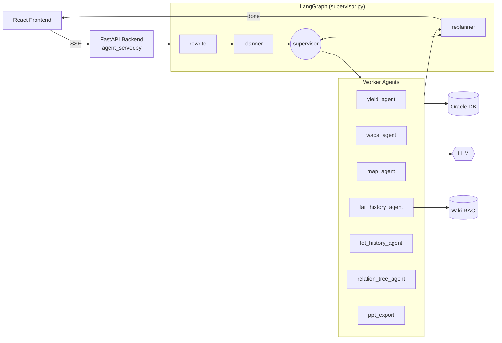

# 08-YieldAgent 아키텍처 모식도

LangGraph `StateGraph` 기반 멀티 에이전트 백엔드.
- **Frontend**: React (별도 레포). `app.py` (Streamlit)는 백엔드 개발용 테스트 UI.
- **Backend**: FastAPI + SSE (`agent_server.py`, uvicorn :8001)
- **흐름**: `rewrite → planner → supervisor ↔ workers → replanner → (supervisor | END)`
- **상태**: 모든 노드는 `YieldQueryState` (artifacts, task_plan, past_steps) 공유

## Worker Agents

| Agent | 타입 | 주 업무 | 핵심 의존성 |
| --- | --- | --- | --- |
| `yield_agent` | ReAct | PT1H/PT1C/GMS 수율 + 이상치 + LLM 해석 | `yield_db.py`, `yield_viz.py` |
| `wads_agent` | ReAct | WADS 열화 리포트 서브그래프 | `wads_tools.py` |
| `map_agent` | Functional | wafer binmap/cummap PNG 생성 | matplotlib + Oracle |
| `fail_history_agent` | Functional | 불량 이력 + Wiki RAG 합성 | `fail_history_tools.py`, `wiki_*` |
| `lot_history_agent` | Functional | Lot ID 5개 테이블 횡단 조회 | `lot_history_tools.py` |
| `relation_tree_agent` | Functional | Inline-WT 상관 분석 (placeholder) | — |
| `ppt_export` | Functional | 누적 artifact → PPTX 패키징 | `ppt_builder/renderer/llm_designer` |

## External Resources

- **Oracle DB** — `common.py`의 oracledb 풀
- **LLMs** — `prompts.py`에 모델 설정 중앙화 (gpt-oss-120b 등)
- **Wiki RAG** — `wiki_router/store/summarizer/queue` (fail-history 보조)

## Retry / Error
- 모든 노드 `RetryPolicy(max_attempts=3)`
- `is_transient_error()`로 ConnectionError / TimeoutError / 5xx 분류
