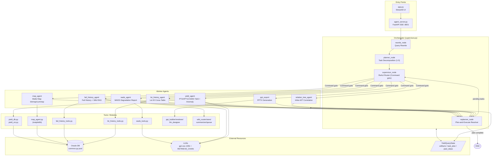

# 08-YieldAgent 아키텍처 모식도

LangGraph `StateGraph` 기반 멀티 에이전트 구조입니다.
- **흐름**: `Entry → rewrite → planner → supervisor ↔ workers → replanner → (supervisor | END)`
- **상태**: 모든 노드는 `YieldQueryState`(artifact accumulators, task_plan, past_steps)를 공유

## 구성 요약

### Entry Points
| 파일 | 역할 |
| --- | --- |
| `app.py` | Streamlit 사용자 UI |
| `agent_server.py` | FastAPI + SSE 백엔드 (uvicorn :8001) |

### Orchestrator (supervisor.py)
| 노드 | 역할 |
| --- | --- |
| `rewrite_node` | 사용자 질의 정제 |
| `planner_node` | 1~5개의 `TaskItem`으로 분해 |
| `supervisor_node` | ReAct 라우터, `Command(goto=...)`로 worker 디스패치 |
| `replanner_node` | plan-and-execute 단계의 chained-input 해결, 종료 판단 |

### Worker Agents
| Agent | 타입 | 주 업무 |
| --- | --- | --- |
| `yield_agent` | ReAct | PT1H/PT1C/GMS 수율 조회, 이상치 탐지, LLM 해석 |
| `wads_agent` | ReAct (`create_react_agent`) | WADS 열화 리포트 서브그래프 |
| `map_agent` | Functional | wafer binmap/cummap PNG(base64) 생성 |
| `fail_history_agent` | Functional | 불량 이력 조회 + wiki 기반 합성 |
| `lot_history_agent` | Functional | Lot ID로 5개 Oracle 테이블 횡단 조회 |
| `relation_tree_agent` | Functional | Inline-WT 상관 분석 (phase1 placeholder) |
| `ppt_export` | Functional | 누적 artifact를 PPTX로 패키징 |

### External Resources
- **Oracle DB**: `common.py` connection pool (yield, GMS, PT1C, lot history, wafer map)
- **Wiki Memory**: `wiki_*.py` (RAG 보조)
- **LLMs**: `prompts.py`에 중앙화된 모델 설정
- **State**: 40+ 필드, `operator.add` reducer로 artifact 누적

### Retry / 에러
- 모든 노드 `RetryPolicy(max_attempts=3)` 적용
- `is_transient_error()`로 ConnectionError / TimeoutError / 5xx 분류
