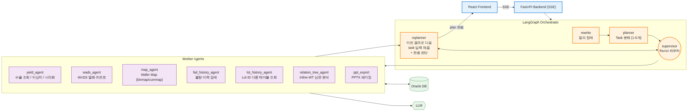
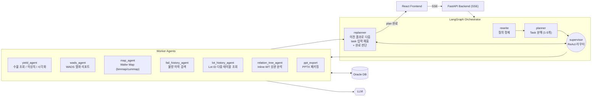

# 08-YieldAgent 아키텍처 모식도

LangGraph `StateGraph` 기반 멀티 에이전트 백엔드.
- **Frontend**: React (별도 레포). Streamlit은 백엔드 개발용 테스트 UI라 다이어그램에서 제외.
- **Backend**: FastAPI + SSE
- **흐름**: `rewrite → planner → supervisor ↔ workers → replanner → (supervisor | END)`
- **상태**: 모든 노드는 `YieldQueryState` (artifacts, task_plan, past_steps) 공유

## Orchestrator 노드

| 노드 | 역할 |
| --- | --- |
| `rewrite` | 사용자 질의를 명료한 형태로 정제 |
| `planner` | 질의를 1~5개의 `TaskItem`으로 분해 |
| `supervisor` | ReAct 라우터, `Command(goto=...)`로 worker 디스패치 |
| `replanner` | ① 이전 task 결과(`past_steps`)로 다음 task의 빈 파라미터를 채워넣음 (chained-input 해소). 우선 코드로 시도하고 안 되면 LLM이 채움. ② 모든 task가 끝났으면 최종 응답을 set하고 `END`로 분기 |

## Worker Agents

| Agent | 주 업무 |
| --- | --- |
| `yield_agent` | 수율 조회 / 이상치 탐지 / 시각화 |
| `wads_agent` | WADS 열화 리포트 |
| `map_agent` | Wafer Map (binmap / cummap) |
| `fail_history_agent` | 불량 이력 검색 |
| `lot_history_agent` | Lot ID 다중 테이블 조회 |
| `relation_tree_agent` | Inline-WT 상관 분석 |
| `ppt_export` | 누적 artifact → PPTX 패키징 |

## External Resources

- **Oracle DB** — 모든 데이터 조회/저장 통로 (worker ↔ DB 양방향)
- **LLM** — 분석/요약/리포트 생성

## Retry / Error
- 모든 노드 `RetryPolicy(max_attempts=3)`
- ConnectionError / TimeoutError / 5xx 등 transient error만 재시도
