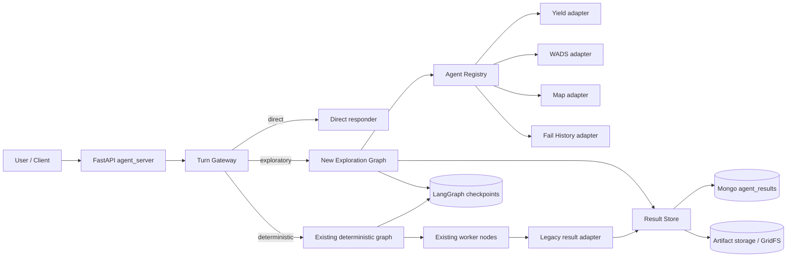
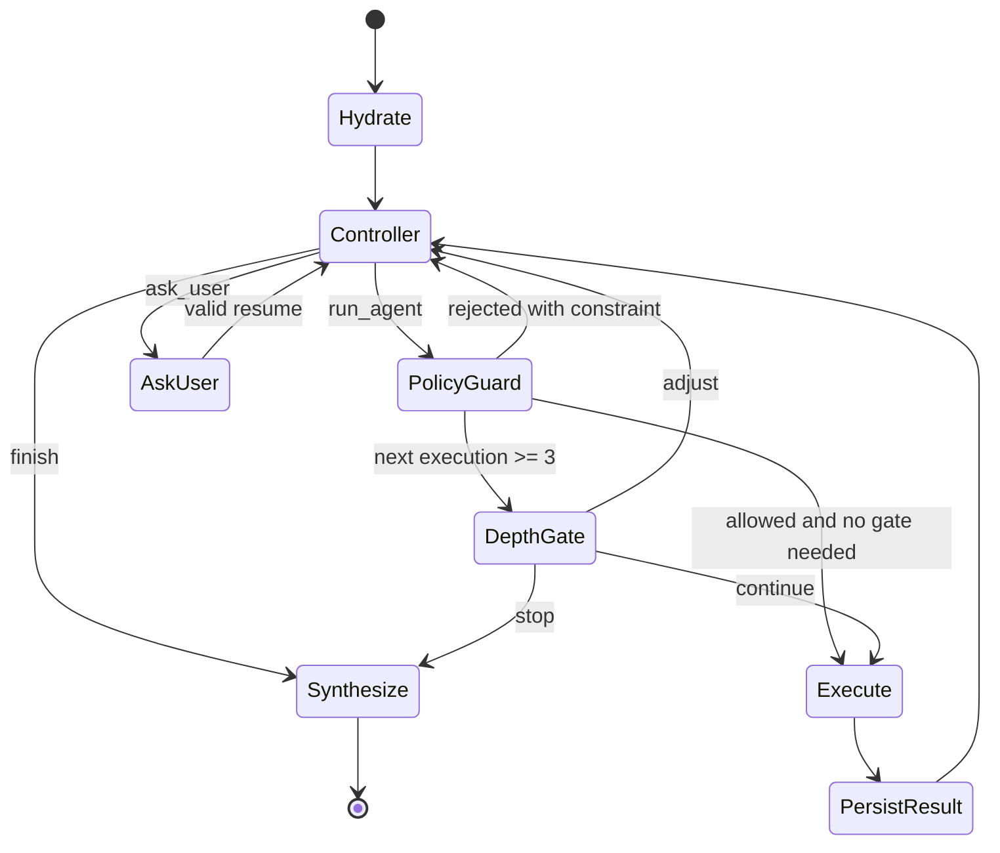

# 하이브리드 멀티에이전트 오케스트레이션 설계

- 상태: 승인된 설계
- 작성일: 2026-07-12
- 대상: `08-YieldAgent`
- 범위: 기존 결정형 LangGraph를 보존하면서 탐색형 오케스트레이션을 별도 lane으로 추가

## 1. 배경

현재 시스템은 `planner -> task_normalizer_validator -> plan_review -> supervisor -> worker -> replanner` 형태의 결정형 plan-and-execute 그래프다. Yield, WADS, Map 외 여러 worker를 하나의 공유 `YieldQueryState`에서 실행한다. 이 구조는 사용자가 수행할 작업을 구체적으로 지정한 경우 예측 가능하고 검토하기 쉽다.

반면 다음 유형은 현재 구조와 맞지 않는다.

- 원인 분석처럼 다음 작업이 이전 관측 결과에 따라 달라지는 요청
- WADS 결과에서 lot을 얻고 Map 또는 Fail History로 후속 조사하는 다단계 요청
- 중간 결과가 비거나 일부만 성공했을 때 다른 증거 경로를 선택해야 하는 요청
- 사용자가 두 단계까지는 자동 조사를 허용하되 깊은 조사 전에 개입하려는 요청

현재 코드 검토에서 확인된 문제도 새 구조의 경계가 필요한 이유다.

- 최근 메시지 슬라이싱이 실제 대화 turn이 아니라 메시지 개수를 기준으로 해 이전 Human 메시지가 빠질 수 있다.
- pending interrupt를 빈 `Command(resume="")`로 소진하면 남은 기존 task가 실행될 가능성이 있다.
- 동일 세션 동시 요청을 막는 서버 정책이 없다.
- checkpoint의 메시지와 artifact/result 데이터가 장기 대화에서 계속 커질 수 있다.
- upstream 실패 또는 empty 결과가 downstream 잘못된 실행으로 이어질 수 있다.
- worker별 artifact/state 계약 차이가 있어 일부 결과가 checkpoint 또는 SSE 변환 과정에서 유실될 수 있다.

이 설계는 자연어 표현별 분기를 추가해 위 문제를 덮지 않는다. 대화 context, 구조화된 요청, 구조화된 결과, 명시적 실행 정책을 분리한다.

## 2. 목표

1. 기존 결정형 요청의 동작과 회귀 안정성을 보존한다.
2. 결과를 보고 다음 조사 단계를 선택하는 탐색형 실행을 지원한다.
3. 멀티턴 대화와 graph 내부 실행 메시지를 분리한다.
4. agent 간 전달을 자연어가 아닌 `TaskSpec`, `InputBinding`, `ResultEnvelope`로 제한한다.
5. Exploration checkpoint에는 작은 참조만 두고 큰 결과와 artifact는 외부 저장소에 둔다. 완료된 legacy deterministic checkpoint도 payload를 compact한다.
6. 자동 실행 범위, HITL, 동시성, 취소, active execution budget을 서버 정책으로 강제한다.
7. 실제 DB, 실제 LLM, 실제 도구를 포함한 E2E 평가로 rollout 여부를 결정한다.

## 3. 비목표

- 기존 `supervisor.py` 내부를 첫 단계에서 재작성하지 않는다.
- 기존 9개 worker 전체를 한 번에 탐색형 lane으로 옮기지 않는다.
- DeepAgents 또는 완전 자율형 범용 supervisor로 교체하지 않는다.
- 자연어 keyword, regex, 문구 목록, 한국어 표현표, 실패 문구별 special case를 추가하지 않는다.
- few-shot 예시를 계속 추가해 planner 동작을 보정하지 않는다.
- 첫 버전에서 worker 병렬 실행을 지원하지 않는다. 독립 task도 순차 실행한다.
- worker의 도메인 SQL, 시각화, 분석 prompt를 필요 없이 변경하지 않는다.
- 승인된 파일 경계 밖의 인접 코드 정리는 하지 않는다.

## 4. 선택한 접근

### 4.1 Strangler 방식 하이브리드

기존 결정형 그래프를 유지하고 별도 Exploration Graph를 추가한다. `Turn Gateway`가 매 입력을 `direct`, `deterministic`, `exploratory` 중 하나로 분류한다.



선택 이유:

- 기존 결정형 경로의 회귀 범위를 최소화한다.
- 탐색형 정책과 state를 기존 대형 공유 state에서 격리한다.
- shadow, canary, 즉시 fallback이 가능하다.
- worker 실행과 결과 계약은 두 lane이 공유하므로 장기적으로 중복을 줄일 수 있다.

### 4.2 대안과 제외 이유

1. 기존 supervisor에 탐색 loop 추가: 초기 파일 수는 적지만 기존 queue, replan, HITL 의미가 섞이고 회귀 위험이 가장 크다.
2. 전체 DeepAgents 교체: 자율성은 높지만 현재 DB/tool 계약, SSE, checkpoint, domain 검증을 한 번에 다시 만들어야 한다.
3. 선택안인 별도 Exploration Graph: 파일과 graph가 하나 늘지만 경계, rollback, 평가가 명확하다.

## 5. 상위 컴포넌트

### 5.1 Turn Gateway

위치: `08-YieldAgent/hybrid_router.py`

책임:

- canonical input protocol 검증
- 세션 run 상태 원자적 획득과 해제
- 최근 완료 대화 3 turn 로드
- Mode Classifier 호출과 fallback 적용
- lane별 graph `thread_id` 선택
- pending HITL의 resume 또는 cancel-and-start 처리
- SSE 시작/종료/error 이벤트에 `run_id`, `lane` 연결

Gateway는 agent 작업을 계획하지 않는다. 요청을 어느 lane으로 보낼지만 결정한다.

### 5.2 Existing Deterministic Graph

위치: 기존 `08-YieldAgent/supervisor.py`

초기 migration에서 export된 `workflow`와 내부 node/edge를 유지한다. 구체적인 단일 작업, 사용자가 지정한 순서형 작업, 기존 plan review 흐름은 이 lane을 사용한다.

Foundation 단계에서는 기존 graph 결과를 서버 경계의 legacy result adapter를 통해 Result Store에도 기록하되, 기존 graph가 기대하는 state/result 형식은 보존한다. 기존 deterministic graph는 Registry를 통해 worker를 재호출하지 않는다. dual-write 실패가 기존 사용자 응답을 실패시키지 않으며 별도 관측 오류로 기록된다.

완료된 deterministic turn은 SSE 전송과 Result Store 저장 뒤 서버가 checkpoint를 compact한다. `messages`는 최근 완료 user/final-assistant 3 turn으로 `Overwrite`하고, bounded recent-result index만 남기며 artifact accumulator는 Result Store 참조로 치환한다. pending interrupt가 있는 legacy checkpoint는 resume에 필요한 graph state를 보존하므로 이 compaction 대상에서 제외한다. 이 호환성 예외는 20-turn completed-checkpoint 크기 gate와 별도로 관측한다. 이 처리는 `agent_server.py` 경계에 두어 `supervisor.py` node/edge를 바꾸지 않는다.

### 5.3 Exploration Graph

위치: `08-YieldAgent/exploration_graph.py`

책임:

- 현재 증거 평가
- 다음 worker task 1개 선택
- Policy Guard 통과 후 worker 실행
- 결과 저장과 작은 `ResultRef` 축적
- 3번째 worker부터 HITL
- 증거가 충분하거나 예산이 끝나면 grounded final response 생성

초기 allowlist:

- `yield_agent`
- `wads_agent`
- `map_agent`
- `fail_history_agent`

모두 read-only, low-risk worker로 등록한다. 다른 agent는 기존 결정형 lane에서만 사용한다.

### 5.4 Agent Registry와 Task Executor

위치: `08-YieldAgent/agent_registry.py`

Registry 항목은 다음 metadata와 adapter를 가진다.

- canonical agent name
- lane allowlist
- risk level
- input model
- output adapter
- 실행 함수
- transient error classifier

Exploration Task Executor는 Registry를 통해서만 worker를 호출한다. Exploration Controller가 Python 함수나 tool을 직접 선택하지 못한다. 첫 버전 adapter는 기존 node를 감싸 private input state를 만들고 결과를 `ResultEnvelope`로 변환한다.

각 호출은 독립된 invocation namespace를 사용한다. worker가 subgraph이면 per-invocation state를 사용하고 parent checkpoint에 worker 내부 message/state를 합치지 않는다. parent에는 `TaskRecord`와 `ResultRef`만 돌아온다.

### 5.5 Result Store

위치: `08-YieldAgent/result_store.py`

책임:

- full `ResultEnvelope`를 MongoDB `agent_results`에 저장
- 큰 HTML, image, PPTX 등 artifact payload를 첫 구현에서는 GridFS에 저장
- `result_id`로 결과 조회
- binding에 필요한 field를 full result에서 읽기
- session 삭제 시 관련 result와 artifact를 함께 삭제

`agent_results` document는 `session_id`, `run_id`, `result_id`, validated `envelope`를 가진다. artifact backend는 interface로 감싸되 첫 구현의 backend 선택은 GridFS로 고정한다. Exploration checkpoint에는 payload를 저장하지 않는다. session 삭제는 result와 artifact를 즉시 cascade 삭제한다. 자동 TTL은 기존 chat/checkpoint retention 값이 설정된 환경에서만 같은 값으로 적용하고, 기존 TTL이 없으면 새 TTL을 만들지 않는다.

## 6. Canonical 입력 계약

`ChatRequest`에 다음 canonical field를 추가한다.

```python
class TurnInput(BaseModel):
    session_id: str
    user_id: str = ""
    input_type: Literal["new_turn", "resume", "cancel_and_start"]
    query: str = ""
    resume: (
        ExplorationContinueResume
        | ExplorationQuestionResume
        | MissingParamResume
        | PlanReviewResume
        | None
    ) = None
    expected_pending_run_id: str | None = None

class ResumeBase(BaseModel):
    run_id: str
    gate_id: str

class ExplorationContinueResume(ResumeBase):
    interrupt_type: Literal["exploration_continue"]
    action: Literal["continue", "adjust", "stop"]
    adjustment: str = ""

class ExplorationQuestionResume(ResumeBase):
    interrupt_type: Literal["exploration_question"]
    answer: str | dict[str, JsonValue]

class MissingParamResume(ResumeBase):
    interrupt_type: Literal["missing_param"]
    values: dict[str, JsonValue]

class PlanReviewResume(ResumeBase):
    interrupt_type: Literal["plan_review"]
    action: Literal["approve", "modify", "cancel"]
    modification: str = ""
```

검증 규칙:

- `new_turn`: `query` 필수. pending gate가 있으면 `409 pending_gate`를 반환한다.
- `resume`: `resume` 필수. `run_id`, `gate_id`, `interrupt_type`이 현재 pending 값과 정확히 일치해야 한다. payload는 해당 interrupt model로 검증한다.
- `cancel_and_start`: `query`, `expected_pending_run_id` 필수. 기존 pending run을 취소하고 새 generation에서 시작한다.
- actively streaming 중인 세션은 모든 새 실행에 `409 run_in_progress`를 반환한다.
- `resume_value` 존재 여부를 LLM으로 `answer` 또는 `new`로 판정하는 흐름은 제거한다.
- migration 동안 기존 `resume_value` 요청은 현재 pending interrupt에 그대로 전달하는 legacy 경로만 유지한다. 이 경로에서도 `answer`/`new` LLM 판정은 제거한다. 새 client는 canonical `resume`을 사용하고 Phase 4 종료 시 legacy 경로를 제거한다.

## 7. Mode Classifier

Mode Classifier는 최근 완료 대화 3 turn과 현재 query만 본다. worker 내부 message, task queue, artifact payload는 보지 않는다.

Classifier는 `new_turn`과 취소 처리가 끝난 `cancel_and_start`의 새 query에만 호출한다. `resume`은 현재 pending run의 lane과 gate로 직접 전달하며 재분류하지 않는다.

```python
class ModeDecision(BaseModel):
    mode: Literal["direct", "deterministic", "exploratory"]
    confidence: float = Field(ge=0.0, le=1.0)
    reason: str
    requested_capabilities: list[str]
```

분류 의미:

- `direct`: DB/tool 실행 없이 답할 수 있는 대화 또는 system capability 안내
- `deterministic`: 구체적인 조회나 명시된 작업 순서를 기존 plan-and-execute로 수행 가능
- `exploratory`: 다음 작업이 아직 정해지지 않았고 관측 결과에 따라 증거 경로를 선택해야 함

정책:

- structured output validation 실패, timeout, provider 오류 시 `deterministic`으로 fallback한다.
- 유효 응답이어도 `confidence < 0.65`이면 `deterministic`으로 fallback한다.
- keyword, regex, phrase list로 mode를 보정하지 않는다.
- classifier는 task params를 생성하지 않는다.
- ModeDecision과 최종 적용 mode를 trace에 모두 기록한다.

`direct` 응답은 `hybrid_router.py`의 tool 없는 작은 responder가 만든다. responder는 worker를 호출하거나 lane을 바꾸지 않는다. direct 오분류는 trace와 evaluation에서 측정한다.

## 8. Parent state와 대화 경계

```python
class HybridState(TypedDict):
    conversation: list[ConversationTurn]
    turn: TurnContext
    run: RunContext
    tasks: list[TaskRecord]
    result_index: list[ResultRef]
    pending_gate: PendingGate | None
    response: FinalResponse | None
```

### 8.1 `conversation`

- 완료된 실제 사용자/최종 assistant turn만 저장한다.
- 최대 최근 3 turn이다.
- 현재 user query는 `turn`에 있고 완료 후에만 conversation history에 합쳐진다.
- supervisor reasoning, planner message, worker message, tool message, HITL 내부 prompt는 제외한다.
- 최근 3 turn 계산은 message 개수가 아니라 완성된 user-assistant pair를 기준으로 한다.

### 8.2 `turn`

```python
class TurnContext(BaseModel):
    query: str
    user_id: str
    mode: Literal["direct", "deterministic", "exploratory"]
    started_at: datetime
```

### 8.3 `run`

```python
class RunContext(BaseModel):
    run_id: str
    session_id: str
    generation: int
    lane: Literal["direct", "deterministic", "exploratory"]
    status: Literal["running", "waiting_hitl", "completed", "cancelled", "failed"]
    worker_executions: int = 0
    per_agent_executions: dict[str, int] = Field(default_factory=dict)
    started_at: datetime
    active_seconds: float = 0.0
    remaining_active_seconds: float = 240.0
    segment_deadline_at: datetime
```

`worker_executions`는 logical worker task 수다. 같은 task의 transient retry는 별도 worker execution으로 세지 않지만 240초 active execution budget에는 포함한다. `waiting_hitl` 동안 human wait time은 budget에서 제외한다. resume 시 남은 budget으로 새 `segment_deadline_at`을 계산한다.

총 실행 수와 agent별 실행 수는 worker 호출 직전에 증가한다. `success`, `partial`, `empty`, 최종 `error` 모두 1회로 센다. transient retry만 같은 logical execution 안에서 처리한다.

### 8.4 `tasks`

task별 상태만 보관한다. input/output payload는 넣지 않는다.

```python
class TaskRecord(BaseModel):
    task_id: str
    spec: TaskSpec
    status: Literal[
        "proposed", "approved", "running", "success", "partial",
        "empty", "error", "skipped", "cancelled"
    ]
    result_id: str | None = None
    error_code: str | None = None
```

### 8.5 `result_index`

- 최근 10개 `ResultRef`만 보관한다.
- result 저장 시 `result_index = (result_index + [new_ref])[-10:]`로 `Overwrite`한다. append reducer로 무한 누적하지 않는다.
- full result는 `result_id`로 Result Store에서 읽는다.
- summary preview, entity key, artifact ref metadata만 포함한다.
- HTML, base64, table rows, raw model output은 넣지 않는다.

## 9. Agent 간 계약

### 9.1 TaskSpec

```python
class TaskSpec(BaseModel):
    task_id: str
    agent: str
    goal: str
    params: dict[str, JsonValue]
    depends_on: list[str] = Field(default_factory=list)
    input_bindings: list[InputBinding] = Field(default_factory=list)
    on_failure: Literal["stop", "ask_user", "continue_independent"] = "stop"
```

`goal`은 관측성과 worker prompt context용이다. 실행 parameter의 source of truth는 `params`와 `input_bindings`다. Controller가 goal 문장 안에 숨긴 값을 executor가 추출하지 않는다.

### 9.2 InputBinding

```python
class InputBinding(BaseModel):
    target_param: str
    source_task_id: str
    source_path: str
    cardinality: Literal["one", "many"]
    required: bool = True
```

예:

```json
{
  "target_param": "lot_ids",
  "source_task_id": "task_wads_1",
  "source_path": "entities.lot_ids",
  "cardinality": "many",
  "required": true
}
```

binding은 exact dotted path 조회와 Pydantic validation만 수행한다. 자연어 reference resolver, positional parsing, keyword 추론을 사용하지 않는다.

필수 binding source가 `empty`, `error`, `invalid`이거나 path가 없으면 dependent task는 무조건 `skipped`다. `on_failure`가 이 안전 규칙을 우회할 수 없다. Controller는 독립적인 다른 evidence path만 제안할 수 있다.

### 9.3 ResultEnvelope

기존 `result_contracts.py`의 `ResultEnvelopeV1`을 source of truth로 재사용한다. 기존 field를 제거하거나 이름을 바꾸지 않고 `metrics`와 provenance field만 additive 확장한다. 별도 중복 schema를 만들지 않는다.

```python
class ResultEnvelopeV1(BaseModel):
    schema_version: Literal["result-envelope/v1"]
    result_id: str
    source_agent: str
    kind: ResultKind
    status: ResultStatus
    title: str
    summary: str
    columns: list[ResultColumn]
    rows: list[dict[str, JsonValue]]
    entities: ResultEntitySet
    metrics: dict[str, JsonValue] = Field(default_factory=dict)
    artifact_refs: list[ArtifactRef]
    provenance: ResultProvenance
    metadata: dict[str, str | int | float | bool | None]
    extensions: dict[str, dict[str, JsonValue]]
    followups: list[dict[str, JsonValue]]
    created_at: datetime

class ResultProvenance(BaseModel):
    task_id: str = ""
    task_goal: str = ""
    source_tool: str = ""
    source_query: str = ""
    display_order: int = 0
    turn_index: int = 0
    run_id: str = ""
    input_result_ids: list[str] = Field(default_factory=list)
    execution_params: dict[str, JsonValue] = Field(default_factory=dict)
    trace_ids: dict[str, str] = Field(default_factory=dict)
    agent_version: str = ""
    started_at: datetime | None = None
    completed_at: datetime | None = None
```

`metrics`는 downstream 판단에 필요한 정규화된 수치/상태 값이다. 기존 `metadata`는 row count, artifact count 같은 기술 metadata 용도로 유지한다. `provenance`에는 최소 다음을 둔다.

- source task와 input result IDs
- 정규화된 실행 params
- DB/tool/model trace IDs
- 실행 시각과 agent version

worker output은 다음 agent 호출, route, goto, follow-up task 같은 orchestration instruction을 포함할 수 없다. 기존 `followups` field는 legacy deterministic transition 동안만 읽고 Exploration Graph에서는 무시한다.

### 9.4 ResultRef

```python
class ResultRef(BaseModel):
    result_id: str
    task_id: str
    source_agent: str
    status: str
    summary_preview: str
    entity_keys: list[str]
    artifact_refs: list[ArtifactRef]
```

`summary_preview`와 `artifact_refs`는 기존 `result_contracts.py`의 제한값을 따른다. binding 실행 시 ResultRef의 preview가 아니라 Result Store의 validated full envelope를 사용한다.

## 10. Exploration Graph 동작



### 10.1 Explore Controller

매 decision cycle에 structured LLM call 1회를 사용한다.

입력:

- 현재 user goal
- 최근 완료 대화 3 turn
- `ResultRef` 목록과 필요 시 Result Store에서 가져온 bounded evidence view
- completed/failed/skipped task 요약
- 남은 worker execution 수와 active execution budget
- Registry의 허용 agent capability schema

출력:

```python
class ControllerDecision(BaseModel):
    action: Literal["finish", "run_agent", "ask_user"]
    rationale: str
    task: TaskSpec | None = None
    question: str | None = None
    evidence_result_ids: list[str] = Field(default_factory=list)
```

규칙:

- `run_agent`는 decision당 task 1개만 제안한다.
- `finish`는 결론에 사용한 `evidence_result_ids`를 반드시 제공한다.
- `ask_user`는 `question`을 필수로 제공하고 `exploration_question` interrupt를 만든다. resume answer는 Gateway가 해석하지 않고 다음 Controller call의 구조화된 context로 전달한다.
- `action`, `task`, `question` 조합은 Pydantic model validator로 검증한다.
- output validation 실패 시 한 번 재시도한다.
- 두 번째도 실패하면 기존 evidence만으로 안전 종료한다. evidence가 없으면 조사 실패를 명시하고 사실을 생성하지 않는다.
- Controller rationale은 실행 권한이 아니다. Policy Guard만 실행을 허용한다.

### 10.2 Policy Guard

LLM을 사용하지 않는 deterministic validation이다.

검증 항목:

1. agent가 Registry와 Exploration allowlist에 존재
2. read-only, low-risk agent
3. 총 worker execution이 5 미만
4. 동일 agent execution이 2 미만
5. active execution budget 안에서 실행 가능
6. task ID와 dependency가 유효하고 cycle 없음
7. binding source와 cardinality가 input model과 일치
8. `agent + canonical params + input result IDs` fingerprint가 기존 실행과 중복되지 않음
9. required upstream 결과가 success 또는 허용 가능한 partial

같은 policy violation이 두 번 반복되면 controller loop를 끝내고 현재 evidence로 안전 종료한다.

### 10.3 자동 실행과 HITL

- worker execution #1, #2: Policy Guard 통과 시 자동 실행
- #3, #4, #5: 각 실행 직전에 별도 `exploration_continue` interrupt
- 총 worker execution hard max: 5
- 동일 agent hard max: 2
- turn hard active execution budget: 240초. HITL 대기시간 제외

interrupt payload:

```json
{
  "type": "exploration_continue",
  "run_id": "run_...",
  "gate_id": "gate_...",
  "findings": [
    {"result_id": "result_...", "summary": "..."}
  ],
  "proposed_task": {
    "task_id": "task_...",
    "agent": "map_agent",
    "goal": "..."
  },
  "remaining_worker_executions": 3,
  "options": [
    {"value": "continue", "label": "계속"},
    {"value": "adjust", "label": "조정"},
    {"value": "stop", "label": "중단 후 현재 결과 정리"}
  ]
}
```

- `continue`: 현재 proposed task 1개만 승인
- `adjust`: adjustment text와 현재 evidence를 Controller에 다시 주고 새 task를 제안. 기존 gate를 닫고 새 `gate_id`의 `exploration_continue` interrupt를 만들어 다시 승인
- `stop`: 추가 worker 없이 현재 evidence로 final response 생성

`interrupt()` 전에는 외부 side effect를 실행하지 않는다. resume은 정확한 `run_id`, `gate_id`와 `Command(resume=...)`로만 처리한다.

### 10.4 결과별 다음 동작

- `success`: evidence에 추가하고 Controller 재평가
- `partial`: warning과 누락 범위를 evidence에 포함. 필요한 binding field가 유효할 때만 downstream 허용
- `empty`: required dependent task skip. Controller가 독립적인 alternate evidence path 선택 가능
- `error`: transient retry 소진 후 task error. `on_failure`에 따라 종료, 사용자 질문, 독립 경로 평가
- `invalid`: adapter/schema 오류. downstream 차단, 관측 오류 기록, 안전 종료 또는 독립 경로 평가

## 11. 최종 응답 grounding

Synthesis node는 `finish` decision 이후에만 실행한다.

규칙:

- 모든 핵심 결론 문장에 최소 하나의 `result_id` 연결
- 데이터가 없는 경우 원인 추정과 확인된 사실을 분리
- `partial`, `empty`, `error`를 숨기지 않음
- artifact는 payload가 아니라 `artifact_ref`로 SSE 전달
- lot, parameter, operation을 evidence 없이 생성하지 않음
- 사용자에게 보이는 답에는 내부 task queue, controller rationale, raw tool output을 노출하지 않음

서버 trace에는 `claim -> result_ids` mapping을 남겨 자동 평가가 가능하게 한다. 첫 버전 UI에는 provenance를 새로 표시하지 않고 기존 message/artifact SSE 표시를 유지한다. SSE model에는 additive `result_ids` metadata만 추가해 client가 무시해도 동작하게 한다.

## 12. 세션 동시성, checkpoint, 취소

### 12.1 세션 run 상태

MongoDB의 작은 session-run record를 원자적으로 갱신한다. 다중 uvicorn worker에서도 in-memory lock에 의존하지 않는다.

상태:

- `running`: worker 또는 graph 실행 중. 다른 실행 차단
- `waiting_hitl`: 실행 중 worker 없음. `resume`, `cancel_and_start`만 허용
- `completed`, `cancelled`, `failed`: lock 해제 상태

lease에는 `run_id`, `generation`, `status`, `expires_at`를 둔다. `running` lease의 `expires_at`은 현재 active segment deadline이다. 비정상 종료된 `running` lease는 이 시각 이후에만 회수한다. `waiting_hitl` record는 기존 session retention까지 유지한다.

### 12.2 graph thread namespace

stable `session_id`와 graph `thread_id`를 분리한다.

```text
{session_id}:{generation}:{lane}
```

Thread Directory는 session별 현재 generation과 lane thread를 기록한다.

- 기존 세션의 첫 migration 시 현재 legacy `thread_id=session_id`를 deterministic thread로 등록해 history를 보존한다.
- 일반 다음 turn은 같은 generation/lane thread를 재사용한다.
- `cancel_and_start`는 pending run을 cancelled로 표시하고 generation을 증가시킨다.
- 새 turn은 새 generation thread에서 시작하고 최근 완료 conversation 3 turn을 외부 history에서 hydrate한다.
- 취소된 thread checkpoint는 실행 대상으로 다시 선택하지 않는다. retention 정리는 별도 lifecycle에서 수행한다.

따라서 stale task를 빈 resume으로 소진할 필요가 없고, 과거 pending checkpoint가 새 요청을 실행하지 못한다.

### 12.3 active execution budget과 취소

- Gateway는 run에 active execution budget 240초를 부여한다.
- Controller, retry, DB/tool, synthesis가 소비한 active 시간을 누적한다.
- `waiting_hitl` 진입 시 budget timer를 멈추고 resume 시 남은 시간으로 새 segment deadline을 계산한다.
- active budget 소진 시 새 worker를 시작하지 않는다.
- 실행 중 호출 취소를 지원하는 adapter는 취소하고, 지원하지 않는 호출 결과는 run generation 확인 후 폐기한다.
- 폐기된 결과는 current checkpoint/result index에 연결하지 않는다.

## 13. 오류 처리

| 상황 | 처리 | 사용자 결과 |
|---|---|---|
| Mode Classifier invalid/timeout | deterministic fallback | 기존 plan flow 계속 |
| Controller invalid output | 1회 재시도, 다시 실패 시 safe finish | 확인된 evidence 또는 실패 설명 |
| worker transient error | 기존 `RetryPolicy(max_attempts=3)` | retry 중 status, 최종 실패 시 요약 |
| worker permanent error | ResultEnvelope `error` 저장 | 정책에 따라 종료/독립 경로/질문 |
| required binding missing | dependent task `skipped` | 누락 evidence 명시 |
| partial result | 유효 field만 사용, warning 유지 | 제한 조건 포함 답변 |
| empty result | dependent task 차단 | 빈 조회 사실 명시 |
| duplicate task | Policy Guard 거부 | 다른 경로 또는 safe finish |
| worker/active-time budget 소진 | 새 task 금지, synthesis | 현재까지 결과 정리 |
| stale resume | `409 stale_gate` | 현재 pending gate 정보 반환 |
| active run 중 새 요청 | `409 run_in_progress` | active run ID 반환 |
| pending gate 중 new_turn | `409 pending_gate` | resume/cancel-and-start 안내 |
| cancel 후 늦은 worker 결과 | generation 불일치로 폐기 | 새 turn에 영향 없음 |
| artifact 저장 실패 | envelope `partial`, metadata 오류 기록 | text 결과와 artifact 실패 안내 |
| Result Store dual-write 실패 in deterministic lane | 기존 응답 유지, 관측 경보 | 기존 deterministic 결과 유지 |

## 14. Observability

모든 event에 다음 correlation field를 연결한다.

- `trace_id`
- `session_id`
- `run_id`
- `generation`
- `lane`
- `task_id`
- `agent`
- `result_id`

필수 event:

- mode decision과 applied fallback
- controller decision
- policy allow/deny와 reason code
- HITL created/resumed/adjusted/stopped
- worker start/retry/end
- result persisted/artifact persisted
- task skipped와 upstream reason
- cancel/budget-exhausted/late-result discard
- final claim-to-result mapping

자연어 prompt 전체나 민감 DB payload를 metric label에 넣지 않는다. 기존 Langfuse/local trace 흐름을 확장한다.

핵심 metric:

- lane별 요청 비율과 fallback 비율
- exploration worker executions 분포
- 동일 task duplicate 차단 수
- HITL continue/adjust/stop 비율
- result status 분포
- evidence recall과 provenance coverage
- p50/p95 active latency, HITL wait latency, budget-exhausted count
- checkpoint BSON size와 result index 길이
- session concurrency conflict 수

## 15. 검증 전략

### 15.1 Phase 0 기준선

기존 deterministic E2E 시나리오를 고정한다. 추가로 domain expert가 승인한 탐색형 12개 scenario record를 만든다. 각 record는 다음을 포함한다.

- 실제 사용자 query와 필요한 대화 history
- 허용 가능한 evidence source 집합
- 반드시 포함할 evidence/result type
- 금지된 claim 또는 fabricated entity
- empty/partial/error 예상 동작
- HITL 예상 위치

구성 비율:

- root-cause 다중 evidence 4개
- WADS 결과 기반 Map 후속 3개
- Yield/Fail History 교차 조사 3개
- empty, partial, transient failure 각 경로를 포함한 복구 2개

각 탐색 scenario는 실제 DB/LLM 환경에서 3회 실행한다.

### 15.2 자동 test 계층

1. Contract test
   - TaskSpec/InputBinding/ResultEnvelope validation
   - artifact payload checkpoint 차단
   - result index 최대 10
2. Graph integration test
   - 두 worker 자동 실행
   - 3번째 직전 interrupt
   - continue/adjust/stop
   - max 5, same agent max 2, active execution budget
3. Concurrency/checkpoint test
   - simultaneous request `409`
   - stale gate `409`
   - cancel-and-start 후 old generation 결과 폐기
   - 20-turn state size
4. Recorded-result replay
   - controller와 policy를 고정 ResultEnvelope로 반복 평가
5. Live E2E
   - 실제 Oracle/OpenSearch 조회
   - 실제 LLM classifier/controller/synthesis
   - 실제 artifact 생성과 조회
   - 실제 Mongo checkpoint/result persistence

### 15.3 필수 live E2E 사용자 흐름

1. root-cause 요청: worker 2개 자동 실행, 3번째 전에 HITL
2. `continue`: 제안 task 1개 실행. Controller가 4번째 또는 5번째 task를 제안하면 실행 직전 새 gate 생성
3. `stop`: 추가 worker 없이 현재 evidence로 응답
4. `adjust`: 수정된 목표로 새 task 제안, 재승인 후 실행
5. pending 중 `cancel_and_start`: old generation task 미실행, 새 query만 실행
6. WADS empty/error: 빈 `lot_ids`로 Map을 호출하지 않음

### 15.4 통과 기준

- 기존 deterministic regression: 100% 통과
- final 핵심 claim provenance: 100%
- fabricated lot/parameter/operation: 0건
- required upstream 실패 후 잘못된 downstream 실행: 0건
- cancel 이후 stale task/result 연결: 0건
- 동시 active run 허용: 0건
- exploration evidence recall: 0.80 이상. scenario의 expected evidence unit 중 실제 `ResultEnvelope`로 확보한 unit 비율
- worker executions: run당 5 이하
- same agent executions: run당 2 이하
- p95 active execution time: 240초 이하. HITL human wait 제외
- active budget 소진 이후 새 worker 시작: 0건
- 대표 20-turn checkpoint BSON size: 256 KiB 이하
- checkpoint `result_index`: 10 이하

기존 `agent_recall`, 즉 호출한 agent 수는 주 평가 지표로 사용하지 않는다. 필요한 evidence와 artifact를 확보했는지 평가한다.

## 16. Rollout

### Phase 0: Baseline과 dataset

- 현재 deterministic live E2E 결과 고정
- 12개 exploration scenario에 domain expert sign-off
- checkpoint/result/latency 계측 추가

종료 조건: 기존 동작 기준값과 exploration 정답 기준이 재현 가능.

### Phase 1: Foundation

- Turn Gateway와 canonical input protocol
- Agent Registry와 Result Store
- lane/thread directory와 session run lock
- 기존 deterministic graph 연결

종료 조건: 모든 요청을 deterministic lane으로 강제했을 때 기존 E2E 100% 통과.

### Phase 2: Worker isolation

- 4개 exploration worker adapter
- private input state
- full ResultEnvelope 외부 저장, parent ResultRef 반환

종료 조건: adapter 전후 domain 결과가 동일하고 artifact 유실 없음.

### Phase 3: Exploration shadow/replay

- Mode Classifier와 Exploration Graph 활성화
- production-like request를 shadow decision으로 평가
- 실제 user response와 worker side effect는 기존 deterministic lane만 사용
- worker 결과는 recorded result replay를 우선 사용

종료 조건: 12개 scenario 통과 기준 충족, policy violation과 hallucinated entity 0건.

### Phase 4: Canary

- exploration eligible traffic 5%
- gate 유지 시 25%
- gate 유지 시 100%
- 모든 단계에서 feature flag로 deterministic fallback 가능

각 단계 승격 조건: 해당 canary 비율에서 eligible 실제 요청 100건 이상을 평가하고, 12개 고정 scenario를 각 3회 재실행해 15.4 통과 기준을 전부 유지한다. 하나라도 위반하면 exploration routing을 0%로 내리고 deterministic lane으로 복귀한다.

## 17. 파일 변경 경계

### 새 파일

- `08-YieldAgent/hybrid_router.py`: Gateway, classifier, run lock/thread directory orchestration
- `08-YieldAgent/exploration_graph.py`: exploration state와 node/edge
- `08-YieldAgent/orchestration_contracts.py`: TurnInput, TaskSpec, InputBinding, run/task state
- `08-YieldAgent/agent_registry.py`: Registry와 초기 4개 worker adapter
- `08-YieldAgent/result_store.py`: Mongo result와 artifact backend interface

### 최소 수정 파일

- `08-YieldAgent/agent_server.py`: 두 graph compile, canonical request, SSE correlation, Gateway 호출
- `08-YieldAgent/models.py`: additive request/SSE field
- `08-YieldAgent/result_contracts.py`: 기존 envelope에 필요한 provenance/orchestration field만 확장
- `08-YieldAgent/tests/`: contract, integration, concurrency, replay, live E2E

### 초기 미수정

- `08-YieldAgent/supervisor.py`: 기존 `workflow` export와 graph 내부 유지
- 각 worker의 domain query/visualization 로직

필요한 adapter 수정이 worker 파일에 불가피하면 구현 전에 해당 변경 이유와 범위를 계획에 명시한다.

## 18. 위험과 대응

### 두 graph의 계약 drift

대응: Exploration Registry output과 deterministic legacy result adapter output에 같은 ResultEnvelope contract test를 적용한다.

### classifier 오분류

대응: 낮은 confidence와 invalid output은 deterministic fallback. mode/applied mode를 기록하고 canary에서 별도 평가한다.

### checkpoint와 Result Store 불일치

대응: result를 먼저 저장한 뒤 ResultRef를 state에 반영한다. ResultRef가 가리키는 result가 없으면 invalid로 처리하고 downstream을 막는다.

### cancel race

대응: run generation을 모든 task/result write에서 비교한다. generation이 다르면 저장 또는 연결하지 않는다.

### 자율 loop 비용 증가

대응: auto 2, max 5, same agent 2, duplicate fingerprint, 240초 active execution budget을 코드 정책으로 강제한다.

### partial/empty를 성공으로 오인

대응: ResultStatus를 binding과 Policy Guard에서 검사하고 required field validation을 통과한 값만 downstream에 전달한다.

### migration 중 기존 응답 회귀

대응: Phase 1에서 all-deterministic 강제 상태로 먼저 검증하고 Result Store dual-write 실패는 기존 응답을 차단하지 않는다.

## 19. 완료 조건

설계 구현은 다음이 모두 충족될 때 완료로 본다.

1. `direct`, `deterministic`, `exploratory` lane이 구조화된 ModeDecision으로 선택된다.
2. 기존 deterministic E2E가 모두 동일하게 통과한다.
3. exploration initial 4 agents가 private state와 shared ResultEnvelope로 실행된다.
4. 첫 2회 자동, 3번째부터 매회 HITL, max 5, same agent max 2, active execution 240초 정책이 우회 불가능하다.
5. 명시적 `new_turn`, `resume`, `cancel_and_start` protocol이 작동한다.
6. 동일 세션 active run이 하나를 넘지 않는다.
7. stale checkpoint/task/result가 cancel 이후 새 generation에 연결되지 않는다.
8. Exploration checkpoint에는 full result와 artifact payload가 없고, 완료된 deterministic checkpoint는 payload가 compact된다.
9. final claim의 provenance가 result ID로 검증된다.
10. 15.4의 live E2E와 rollout gate를 모두 통과한다.

## 20. 참고 자료

- [LangChain multi-agent](https://docs.langchain.com/oss/python/langchain/multi-agent)
- [LangGraph workflows and agents](https://docs.langchain.com/oss/python/langgraph/workflows-agents)
- [LangGraph subgraphs](https://docs.langchain.com/oss/python/langgraph/use-subgraphs)
- [LangGraph persistence](https://docs.langchain.com/oss/python/langgraph/persistence)
- [LangGraph interrupts](https://docs.langchain.com/oss/python/langgraph/interrupts)
- [LangSmith double texting](https://docs.langchain.com/langsmith/double-texting)
