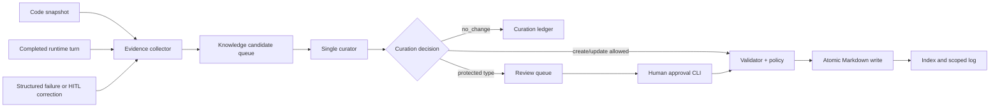

# OKF Multi-Agent Control Knowledge 설계

- 상태: 승인된 설계
- 작성일: 2026-07-21
- 대상: `08-YieldAgent`의 multi-agent orchestration
- 범위: 기존 `08-YieldAgent/wiki/`와 완전히 분리된 control-plane knowledge bundle

## 1. 배경

현재 시스템은 planner, normalizer/validator, plan review, supervisor, worker, replanner가 구조화된 계약으로 협력한다. 실제 권위 있는 연결점은 자연어 설명이 아니라 다음 코드와 런타임 데이터다.

- `canonical_request.py`: canonical request와 task 생성
- `query_state.py`: graph state와 planner 출력 계약
- `result_contracts.py`: agent 결과와 followup 계약
- `supervisor.py`: graph node/edge 구성
- `node_replanner.py`: 결과 기반 후속 task 생성
- `local_trace.py`: 구조화된 실행 trace
- `agent_server.py`: session, HITL, SSE, lifecycle

그러나 이 구조에 대한 지식은 `AGENTS.md`, 설계 문서, 코드 주석, 과거 계획에 분산돼 있다. agent나 개발자가 변경하려면 여러 파일을 넓게 읽어야 하고, 코드나 운영상 교훈이 바뀌어도 설명 문서는 자동으로 따라가지 않는다.

본 설계는 기존 도메인 wiki를 확장하지 않는다. multi-agent 시스템 자체에 관한 지식만 별도 OKF bundle로 관리하고, 구조화된 코드 스냅샷과 실행 증거가 축적될 때 curator가 해당 문서를 갱신한다.

## 2. 목표

1. multi-agent 구조를 예측 가능한 OKF 경로로 제공한다.
2. Codex, Claude, Hermes와 런타임 curator가 동일한 Markdown/YAML 문서를 읽을 수 있게 한다.
3. 코드 스냅샷, contract version, graph topology, trace, HITL 수정에서 control-plane 지식 후보를 자동 수집한다.
4. 일반 worker가 Markdown을 직접 쓰지 않고 단일 curator가 semantic diff를 판단하게 한다.
5. 자동 승격, 검토 필요, 폐기의 권한을 page type과 evidence 종류로 명확히 나눈다.
6. 사용자 query, LOT, 제품, 원본 분석 row, artifact payload가 control-plane vault로 유입되지 않게 한다.
7. schema lint, atomic write, scoped log, revision metadata로 변경을 감사할 수 있게 한다.
8. 실제 LLM, graph, worker, DB, queue를 포함한 end-to-end 검증으로 rollout한다.

## 3. 비목표

- 기존 `08-YieldAgent/wiki/`, `wiki_store.py`, `wiki_queue.py`, `wiki_lint.py`를 변경하지 않는다.
- fail history, WADS 결과, 수율 데이터 등 반도체 도메인 지식을 이 bundle에 저장하지 않는다.
- 각 worker가 자유롭게 Markdown을 생성하거나 기존 canonical page를 직접 수정하지 않는다.
- 자연어 keyword, regex, 표현 목록으로 기억 여부나 문서 경로를 결정하지 않는다.
- 실패 로그의 특정 문구를 코드 조건으로 추가하지 않는다.
- 모든 실행을 문서로 만들지 않는다. 의미 변화가 없는 실행은 `no_change`로 끝낸다.
- 첫 버전에서 Git push, 원격 동기화, UI 기반 문서 편집기를 제공하지 않는다.
- 사용자별 또는 tenant별 운영 지식을 섞지 않는다. 첫 버전 scope는 `system` 하나다.

## 4. 검토한 접근

### 4.1 Worker 직접 쓰기

각 worker가 자기 page를 직접 갱신한다. 구현은 짧지만 동시 수정, 중복 page, 잘못된 일반화, 권한 충돌이 발생한다. ResultEnvelope 생성 책임과 문서 편집 책임도 섞이므로 제외한다.

### 4.2 모든 trace를 Markdown으로 저장

추적성은 높지만 wiki가 로그 저장소가 된다. 검색 결과가 실행 기록에 압도되고 canonical knowledge가 형성되지 않으므로 제외한다.

### 4.3 구조화된 candidate와 단일 curator

코드와 실행 계층은 `KnowledgeCandidate`만 제출한다. curator는 후보의 명시적 subject로 관련 page를 로드하고, 기존 내용과 candidate evidence를 함께 LLM에 제공해 `no_change`, `create`, `update`, `review_required` 중 하나를 선택한다. deterministic validator와 write policy가 LLM 결정의 적용 가능 범위를 제한한다.

이 방식을 선택한다.

## 5. 상위 구조



### 5.1 Evidence collector

Collector는 의미 해석을 하지 않는다. 다음 구조화된 source만 candidate로 변환한다.

- system snapshot: graph node/edge, agent names, allowed slot keys, schema versions
- completed turn summary: 실행 agent, task/result status, followup 종류, validation issue type
- structured failure: exception type, source node, task/result identity
- HITL correction: touchpoint, decision, affected agent/contract; 사용자 원문은 저장하지 않음

Collector는 ResultEnvelope의 `rows`, artifact body, message content, query text를 폐기한다. ID도 session/trace/task/result ID만 유지하고 도메인 entity 값은 유지하지 않는다.

### 5.2 Candidate queue

기존 domain wiki queue와 별개인 bounded async queue다. server response와 분리되며 candidate 생성 또는 curator 실패가 분석 요청을 실패시키지 않는다. queue item은 JSON 직렬화 가능한 `KnowledgeCandidate` 하나다.

### 5.3 Curator

Curator는 후보가 선언한 `subjects`와 `suggested_page_type`으로만 관련 page를 찾는다. 자연어 keyword로 전체 vault 경로를 추론하지 않는다.

LLM 입력은 다음으로 제한한다.

- 검증된 candidate
- candidate subject와 연결된 기존 page
- page template와 write policy
- 허용된 action 목록

LLM 출력은 `CurationDecision` Pydantic model로 검증한다. chain-of-thought를 저장하지 않고 짧은 rationale과 evidence reference만 보존한다.

### 5.4 Validator와 writer

Validator는 OKF 구조, governance field, relation target, allowed status/type, reserved index 규칙을 확인한다. Writer는 같은 filesystem 안에서 temporary file을 쓴 후 `os.replace`로 교체한다. 하나의 worker만 writer를 호출한다.

### 5.5 Review queue

보호 page 변경은 canonical page에 적용하지 않고 `wiki/review_queue/`에 proposal 문서로 저장한다. CLI에서 proposal ID를 승인할 때 동일 validator와 writer를 거쳐 반영한다.

## 6. Bundle 구조

```text
08-YieldAgent/multiagent_knowledge/
├── AGENTS.md
├── CLAUDE.md
├── SCHEMA.md
├── okf.profile.json
├── frontmatter.schema.json
├── raw/
│   ├── README.md
│   ├── snapshots/
│   └── candidates/
└── wiki/
    ├── index.md
    ├── log.md
    ├── architecture/
    │   ├── index.md
    │   ├── system-overview.md
    │   └── state-and-data-flow.md
    ├── agents/
    │   ├── index.md
    │   └── *.md
    ├── workflows/
    │   ├── index.md
    │   └── *.md
    ├── contracts/
    │   ├── index.md
    │   └── *.md
    ├── decisions/
    │   ├── index.md
    │   └── *.md
    ├── runbooks/
    │   ├── index.md
    │   └── *.md
    ├── observations/
    │   ├── index.md
    │   └── *.md
    ├── governance/
    │   ├── index.md
    │   ├── ownership.md
    │   ├── agent-write-policy.md
    │   └── review-policy.md
    └── review_queue/
        └── index.md
```

`wiki/index.md` frontmatter에는 `okf_version`만 둔다. 하위 `index.md`는 frontmatter가 없는 routing page다. 나머지 Markdown은 필수 governance frontmatter를 가진다. `raw/`는 compiled wiki 밖의 immutable evidence다.

## 7. Page 계약

허용 type은 다음으로 고정한다.

- `Agent`
- `Workflow`
- `Contract`
- `Component`
- `Runbook`
- `Observation`
- `Decision`
- `Policy`
- `Proposal`

일반 page 필수 field:

```yaml
type: Agent
title: WADS Agent
description: WADS 분석 worker의 책임과 입출력 경계
status: current
owner: yield-platform
source_status: code-backed
agent_use: read-and-propose
sensitivity: internal
last_reviewed: 2026-07-21
review_cycle: P90D
version: 1
relations:
  implements:
    - "[[contracts/result-envelope]]"
  participates_in:
    - "[[workflows/standard-analysis]]"
evidence_refs:
  - snapshot:sha256:...
```

본문 첫 H1은 `title`과 동일하게 유지해 Tolaria display title 규칙과 호환한다. 관계 값은 wikilink로 표현한다. `_` prefix field는 사용하지 않는다.

## 8. Runtime 계약

### 8.1 KnowledgeCandidate

```python
class KnowledgeCandidate(BaseModel):
    schema_version: Literal["control-knowledge-candidate/v1"]
    candidate_id: str
    scope: Literal["system"]
    source_kind: Literal["system_snapshot", "runtime_observation", "incident", "human_correction"]
    subjects: list[str]
    suggested_page_type: PageType
    summary: str
    facts: list[CandidateFact]
    evidence_refs: list[EvidenceRef]
    sensitivity: Literal["internal"]
    created_at: datetime
```

`facts`는 `{name, value, source_path}` 구조다. `value`는 JSON이며 domain result row와 artifact payload를 허용하지 않는다.

### 8.2 CurationDecision

```python
class CurationDecision(BaseModel):
    action: Literal["no_change", "create", "update", "review_required"]
    target_page_id: str = ""
    proposed_slug: str = ""
    page_type: PageType | None = None
    title: str = ""
    description: str = ""
    body_markdown: str = ""
    relations: dict[str, list[str]] = {}
    evidence_refs: list[str] = []
    rationale: str
```

Validator는 action별 필수값과 candidate evidence 포함 여부를 확인한다.

### 8.3 SystemSnapshot

Snapshot은 코드에서 얻은 다음 값만 가진다.

- graph node와 explicit edge 목록
- canonical agent name과 slot schema
- `RESULT_ENVELOPE_SCHEMA_VERSION`
- `TRACE_SCHEMA_VERSION`
- Followup field 목록
- snapshot을 만든 commit SHA

전체 source code나 prompt는 snapshot에 복사하지 않는다.

## 9. 권한 정책

| Candidate source | Target type | 처리 |
|---|---|---|
| system snapshot | Agent, Workflow, Contract, Component | 자동 create/update 허용 |
| runtime observation | Observation | 자동 create/update 허용 |
| runtime observation | Runbook | proposal만 허용 |
| incident | Observation | 자동 append 허용 |
| incident | Agent, Workflow, Contract | proposal만 허용 |
| human correction | Runbook | proposal만 허용 |
| any | Decision, Policy | proposal만 허용 |
| any | governance page | proposal만 허용 |

일반 worker는 candidate 생성만 할 수 있다. Curator도 policy 밖의 write는 할 수 없다. 승인 CLI는 proposal이 가리키는 exact target만 수정한다.

## 10. 축적 규칙

1. candidate는 immutable JSON evidence로 먼저 저장한다.
2. 동일 evidence hash는 중복 처리하지 않는다.
3. candidate마다 curator 결정 ledger를 기록한다.
4. `no_change`는 정상 결과이며 Markdown을 만들지 않는다.
5. create/update는 기존 page의 unknown frontmatter key를 보존한다.
6. 문서 변경은 version을 1 증가시키고 `updated`, `last_reviewed`, `evidence_refs`를 갱신한다.
7. log는 newest-first로 기록한다.
8. 상충하는 evidence는 기존 내용을 조용히 덮지 않고 proposal에 `contradicts` relation을 포함한다.
9. 삭제는 첫 버전에서 지원하지 않는다. 폐기는 `status: deprecated`와 `superseded_by`로 표현한다.

## 11. 실패와 동시성

- queue full: candidate drop count와 경고를 기록하고 사용자 요청은 성공시킨다.
- curator LLM 실패: candidate를 `pending` 상태로 유지하고 제한된 횟수만 재시도한다.
- invalid LLM output: 적용하지 않고 ledger에 `invalid_decision`을 기록한다.
- validation 실패: canonical page를 바꾸지 않고 proposal에 validation issue를 기록한다.
- process shutdown: bounded drain 후 남은 candidate는 raw pending file로 보존한다.
- 다중 server process: 첫 rollout은 `CONTROL_KNOWLEDGE_WRITER=1`인 단일 process만 writer를 시작한다. 다른 process는 candidate file만 atomic 생성한다.
- knowledge 실패는 graph, SSE, DB 저장을 실패시키지 않는다.

## 12. Agent read 경로

`08-YieldAgent/AGENTS.md`에는 orchestration 또는 contract 변경 전에 다음 순서로 읽도록 짧은 routing rule만 추가한다.

1. `multiagent_knowledge/wiki/index.md`
2. 관련 local index
3. target Agent/Workflow/Contract page
4. linked Decision/Runbook
5. 실제 코드

Wiki는 코드보다 높은 권위가 아니다. `source_status: code-backed` page와 코드가 충돌하면 코드를 근거로 candidate를 만들고 page 변경을 제안한다.

## 13. 환경 설정

- `CONTROL_KNOWLEDGE_ENABLED=false`: candidate 수집 전체 toggle
- `CONTROL_KNOWLEDGE_WRITER=false`: 이 process가 curator/writer인지 결정
- `CONTROL_KNOWLEDGE_ROOT=<repo>/08-YieldAgent/multiagent_knowledge`: bundle root
- `CONTROL_KNOWLEDGE_QUEUE_SIZE=100`: bounded queue
- `CONTROL_KNOWLEDGE_MAX_RETRIES=3`: curator retry
- `CONTROL_KNOWLEDGE_MODEL=<model>`: 미설정 시 기존 LLM factory 기본값

기본값은 비활성이다. shadow 환경에서 candidate와 `no_change` 비율을 확인한 뒤 writer를 켠다.

## 14. 검증과 rollout

### 14.1 단위·통합 검증

- candidate model이 payload와 domain row를 거부한다.
- root/nested index OKF 규칙을 검사한다.
- governance field, type, relation, duplicate page ID를 검사한다.
- 동일 evidence가 한 번만 적용된다.
- protected type은 canonical page 대신 proposal을 생성한다.
- atomic write 실패 시 기존 page가 유지된다.
- queue/curator 실패가 main request를 실패시키지 않는다.

### 14.2 실제 end-to-end 검증

1. 임시 control knowledge root와 실제 LLM으로 system snapshot을 curate한다.
2. 실제 MongoDB, graph, planner와 worker를 실행하는 사용자 시나리오를 수행한다.
3. completed turn이 redacted runtime candidate를 생성하는지 확인한다.
4. curator가 기존 page와 비교해 `no_change` 또는 근거 있는 Observation만 생성하는지 확인한다.
5. 실제 HITL modify 시 원문 없이 `human_correction` candidate가 남는지 확인한다.
6. protected Contract 변경 candidate가 canonical page를 직접 바꾸지 않고 proposal을 만드는지 확인한다.
7. server 재시작 후 pending candidate가 처리되고 중복 적용되지 않는지 확인한다.
8. 기존 domain wiki 파일의 git diff가 비어 있는지 확인한다.

### 14.3 Rollout 단계

1. static bundle과 lint만 도입
2. snapshot/candidate shadow 수집
3. curator `no_write` 판단 기록
4. Observation 자동 write 활성화
5. code-backed Agent/Workflow/Contract 자동 sync 활성화
6. review queue와 승인 CLI 운영

각 단계는 이전 단계의 실제 E2E 결과와 diff 검토 후 진행한다.

## 15. 성공 기준

- 새 개발 agent가 root index에서 세 번 이내의 link 이동으로 target contract를 찾는다.
- code snapshot 변경이 관련 Agent/Workflow/Contract candidate로 표현된다.
- runtime 실행이 사용자/domain payload 없이 Observation candidate를 만든다.
- 동일 실행을 재처리해도 page version이 증가하지 않는다.
- Policy, Decision, governance는 자동으로 canonical 수정되지 않는다.
- knowledge subsystem 장애가 분석 응답 latency와 성공 여부에 영향을 주지 않는다.
- 실제 E2E 후 `08-YieldAgent/wiki/`에는 변경이 없다.

