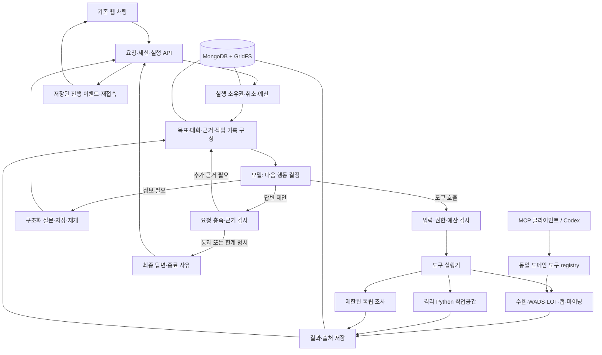

# Yield Agent 목표 기반 하네스 최종 설계

- 작성일: 2026-09-12
- 상태: 구현 및 실제 평가 진행 중. 현재 상태는 연결된 실행 계획의 진행 기록을 따른다.
- 2026-09-12 후속 변경: 사용자가 승인한 [실행부 단순화 계획](../plans/2026-09-12-harness-simplification.md)이 이 문서의 필수 worklog·claims/coverage 완료 계약을 대체한다. 현재 계약은 `harness/README.md`를 따른다. 아래 원설계는 변경 이유를 추적하기 위해 보존한다.
- 대상: `/Users/daehwankim/yield-agent/08-YieldAgent`
- 실행 계획: [단계별 구현 계획](../plans/2026-09-12-goal-driven-harness.md)
- 범위 결정: 기존 웹 UI와 도메인 기능을 유지하고, 하나의 목표 기반 하네스로 중심 제어를 교체한다. Python 분석 실행을 포함하는 전제로 작성했다.
- 이 문서는 Codex의 비공개 구현을 설명하는 문서가 아니다. 공개된 에이전트 실행 개념과 현재 코드에 근거한 이 프로젝트의 설계다.

## 1. 완성될 시스템

사용자 요청을 목표로 유지하면서 모델이 도구를 선택하고, 실행 결과를 관찰하고, 필요한 조사를 추가하고, 근거를 확인한 뒤 답한다. 간단한 질문은 도구 없이 끝날 수 있고, 복합 요청은 최초 계획에 없던 도구도 결과에 따라 사용할 수 있다. 필요하지 않은 작업을 많이 실행하는 것을 자율성으로 평가하지 않는다.

예: “최근 4주 4SS 수율 보여주고 열화 원인 알려줘.”

1. 사용자 요청에서 수율 제시와 원인 설명이라는 완료 항목을 기록한다.
2. 실제 수율을 조회하고 기간·검사 단계·표본 수·이상 구간을 관찰한다.
3. 관측한 구간과 불량 항목을 바탕으로 관련 WADS, LOT 이력, 맵 등을 선택한다.
4. 필요한 경우 확보한 데이터로 Python 비교 분석을 수행한다.
5. 확인된 사실, 원인 후보, 반증, 데이터 부족을 구분한다.
6. 설명에 필요한 근거가 확보됐거나 더 조사할 수 없는 이유가 분명할 때 답한다.

이 순서는 시나리오 예시이며 코드에 고정된 경로가 아니다. 실제 데이터가 정상이라면 불필요한 원인 조사를 시작하지 않는다. 데이터만으로 인과관계를 입증할 수 없다면 원인을 확정하지 않는다.

## 2. 현재 코드에서 확인한 출발점

| 확인한 위치 | 현재 동작 | 설계에 미치는 영향 |
|---|---|---|
| `supervisor.py` | planner → normalizer → plan_review → supervisor → worker → replanner | 루프는 이미 있다. 전체를 새로 만드는 것보다 실행 결정의 책임을 바꾸는 것이 핵심이다. |
| `node_replanner.py:204` | 남은 작업의 빈 chained input을 채울 때 주로 LLM 호출 | 매 관측 이후 목표 달성도를 판단하는 새 루프가 필요하다. |
| 같은 파일의 완료 분기 | pending이 비면 마지막 agent 메시지를 최종 response로 사용 | 도구 성공과 사용자 목표 완료를 분리해야 한다. |
| 같은 파일의 task ID 검사 | 기존 task의 fan-out 외 새 작업 추가 제한 | 새 하네스는 처음 계획의 ID 집합에 갇히지 않아야 한다. |
| `node_supervisor.py:690` | 최대 8회 수준의 dispatch 제한, 한도 초과 시 완료 문구 | 한도 중단을 정상 완료와 구분해야 한다. |
| `result_contracts.py` | 구조화된 결과·출처·artifact 참조가 있음. 행은 최대 50개로 제한 | 메타데이터 계약은 활용하되, 표본과 전체 결과를 분리 저장해야 한다. |
| `agent_server.py` | MongoDBSaver, SSE, 사용자 입력 재개 경로 있음 | 영속화·UI 계약을 재사용한다. 기존 체크포인트를 새 state로 직접 읽지 않는다. |
| `repl_agent/agent.py` | `create_agent`와 `run_python`으로 모델–도구 반복 이미 존재 | Python 기능과 실행 결과 모델을 재사용할 수 있다. |
| `repl_agent/runtime/worker.py` | 별도 프로세스에서 `exec`, 보안 샌드박스는 아님 | 운영용 격리 실행 계층을 추가해야 한다. |
| `repl_agent/session_store.py` | 설정이 없으면 mock 데이터 경로 사용 | 하네스는 저장된 실제 조회 결과를 Python에 전달해야 한다. |
| `tests/conftest.py` | 서버가 없으면 E2E를 skip | 릴리스 검증에서는 skip을 성공으로 취급하지 않는 별도 실행기가 필요하다. |

환경을 읽었을 때 설치된 버전은 LangGraph 1.0.8, LangChain 1.2.9, Pydantic 2.12.3, MongoDB checkpoint 0.3.1, MCP 1.21.0이다. 이 환경의 `.venv`에는 pytest가 설치돼 있지 않았다. 구현 시작 시 lockfile과 실제 환경을 다시 맞춘다. 최신 문서의 API를 현재 버전에 그대로 적용하지 않는다.

이 대화의 이전 진단에서 설정된 OpenRouter 키는 인증 API에서도 401을 반환했다. 모델 평가와 실제 LLM E2E에 앞서 다시 인증을 확인해야 한다. 특정 무료 모델의 사용 가능성이나 품질은 이 설계에서 보장하지 않는다.

## 3. 접근 비교와 선택

| 접근 | 장점 | 한계 | 결정 |
|---|---|---|---|
| 기존 replanner의 조건만 확대 | 초기 수정량이 적음 | task queue·공유 슬롯·후속 sentinel의 제약이 계속 남음 | 채택하지 않음 |
| 자체 하네스 + 기존 도메인 도구 | 웹 UI와 도메인 자산을 유지하며 실행 정책을 직접 관리 | 실행·저장·평가 계층을 구현해야 함 | 채택 |
| 도메인 MCP + Codex를 실행 호스트로 사용 | 별도 호스트의 에이전트 환경 활용 | 사용자가 운영하려는 자체 앱의 하네스와는 역할이 다름 | 상호 운용 경로로 지원 |

최종 실행 경로는 하나다. 2026-07-12 문서의 direct/deterministic/exploratory 분류기를 최종 구조로 추가하지 않는다. 구버전 실행 경로는 배포 전환과 롤백 기간에만 유지한다. 전환 시점에는 세션에 runtime version을 고정하고 자연어로 실행 엔진을 선택하지 않는다.

## 4. 아키텍처



LangGraph는 체크포인트와 재개 가능한 제어 흐름에 사용한다. 모델은 native tool calling으로 다음 도구를 선택한다. 하네스가 입력 검증, 실행 권한, 예산, 동시성, 결과 저장, 종료를 강제한다. 이 경계를 명시하기 위해 작은 StateGraph를 사용하며, 별도 거대 planner·supervisor·replanner LLM 세 개를 매번 실행하지 않는다.

기본 그래프는 `context → model → policy → execute → observe → context`다. 질문은 별도 interrupt 노드, 최종 답변은 별도 검증 노드로 분기한다. 도구 오류도 관측 결과로 돌려준다. 인증·설정 오류는 실행을 중단하고 같은 자격증명으로 대체 자연어 응답을 재시도하지 않는다.

모델에 bind하는 도구는 도메인 도구와 `update_worklog`, `ask_user`, `finish`, 후반 단계의 `delegate_readonly`다. `read_result`, `run_python`은 데이터 접근·계산 도구다. 이 제어 도구들은 MCP 도메인 서버에 노출하지 않는다. 모델의 일반 텍스트 응답도 최종 답변 후보로 검사한다.

## 5. 데이터와 제어 계약

### 5.1 상태의 소유권

| 데이터 | 권위 있는 저장 위치 | 주요 필드 |
|---|---|---|
| 대화 | session message 저장소 | 사용자 원문, 최종 답변, 시각, 요청 ID |
| 실행 | Mongo `harness_runs` | principal/session/run ID, runtime version, status, lease epoch, budget |
| 실행 제어 state | 별도 namespace의 LangGraph checkpoint | goal revision, pending action, compacted context, result/event 참조 |
| 목표·작업 기록 | checkpoint + 변경 이벤트 | 원문, 완료 항목, 확인한 사실, 가설, 미해결 사항 |
| 도구 호출 | Mongo `harness_invocations` | call ID, 도구 버전, 검증된 인자, 시작/종료 상태, result ID |
| 전체 결과·artifact | Mongo metadata + GridFS | 원본 데이터, schema, checksum, row count, 조회 조건, 출처 |
| 진행 이벤트 | Mongo `harness_events` | run ID, 순번, 종류, 안전한 공개 payload |

체크포인트는 재개 위치를 저장하고 호출 기록은 외부 작업 중복과 출처를 관리한다. 두 저장소의 역할을 섞거나, 이벤트 전체를 다시 실행하는 별도 event-sourcing 엔진을 만들지 않는다.

### 5.2 GoalContract

- `original_request`: 사용자 원문. 모델이 재작성한 문장으로 덮어쓰지 않는다.
- `revision`: 사용자 목표 수정마다 증가.
- `acceptance_items`: 모델이 요청에서 추출한 동적 완료 항목. 고정 intent 목록으로 분류하지 않는다.
- `constraints`: 제품, 기간, 명시한 제외 조건, 사용자 승인 범위.
- `open_questions`: 아직 사용자가 제공해야 하는 정보.
- 항목별 `status`: unresolved / supported / limited. `limited`는 결론의 한계를 기록하며 근거 없는 성공 판정에 사용하지 않는다.
- 명확한 인사·일반 설명은 데이터 근거를 요구하지 않고 바로 답할 수 있다.

### 5.3 ToolSpec / ToolObservation

`ToolSpec`은 이름·버전·설명·입력 schema·read/write 영향·재시도 성격·timeout·출력 schema를 가진다. 자연어 조사 순서는 모델이 선택하고, 타입·열거형·ID 검사는 실행 계약 검증에만 사용한다.

`ToolObservation`의 필수 정보:

```text
schema_version, principal_id, session_id, run_id, invocation_id, result_id
tool_name, tool_version, validated_arguments
status: success | partial | empty | error | cancelled
summary, columns, preview_rows, total_rows, truncated
data_ref, artifact_refs, source_result_ids
scope: product, time_range, process, lot_ids, snapshot_time
provenance: source_system, query_fingerprint, executed_at, data_origin
error: code, retryable, safe_message
```

`data_origin`은 `live` 또는 `fixture`이며, 모델이 지정하지 않고 실행 계층이 기록한다. 전체 결과는 50행으로 자르기 전에 보관한다. preview는 최대 50행이며 전체 분석에 쓸 때는 `read_result` 또는 Python 입력으로 `data_ref`를 사용한다. 이미 잘린 legacy envelope에서 원본을 복원했다고 표시하지 않는다.

`read_result(result_id, offset, limit, columns)`는 소유권을 확인하고 페이지를 반환한다. `total_rows`, `truncated`, snapshot을 항상 함께 전달한다. 모델이 만든 임의 경로나 다른 세션 ID를 저장소 접근 권한으로 인정하지 않는다.

### 5.4 판단과 완료

최종 후보는 `answer`, `claims`, `coverage`, `limitations`를 가진다. claim은 `fact`, `hypothesis`, `general` 중 하나이며, 데이터에 관한 fact는 result ID와 행·열 또는 저장된 집계 산출물의 위치를 참조한다.

검증은 두 층이다.

1. 코드 검사: 근거 존재, 소유권, 조회 범위, 결과 상태, 표본/전체 여부, 집계 산출물 출처, 완료 항목 누락.
2. 모델 검사: 요청과 답변이 의미상 맞는지, 인과 주장과 단순 상관을 혼동했는지, 중요한 반증·한계를 빠뜨렸는지.

숫자는 저장된 관측/계산 결과와 비교한다. 또 다른 LLM이 동의했다는 사실을 데이터 검증으로 삼지 않는다. 의미 검사는 오류를 줄이는 장치이며 진실을 보장하는 증명기는 아니다.

검증이 실패하면 부족한 근거를 모델에 돌려준다. 교정 기회는 기본 2회다. 이후에도 부족하거나 예산이 끝나면 `partial`과 미해결 내용을 반환한다. 인증 오류로 검증 LLM을 사용할 수 없으면 가짜 최종 답변 대신 명시적 오류를 반환한다.

종료 상태는 `completed`, `partial`, `waiting_user`, `blocked`, `failed`, `cancelled`로 구분한다. `running`과 `cancelling`은 진행 상태다. 큐 소진·호출 한도·빈 데이터는 그 자체로 완료 조건이 아니다. `completed`는 요청이 충족된 상태이며, 충분한 조사를 통해 원인 확정 불가라는 결론을 근거 있게 제시한 경우도 포함한다. 미실행 요청이나 확보하지 못한 필수 자료가 남으면 `partial`이다.

## 6. 도메인 도구 전환

| 새 도구 | 활용할 기존 코드 | 전환 기준 |
|---|---|---|
| `query_yield` | `yield_db.py`, `yield_query_agent.py` | 전체 조회 결과와 기간 변환 계약 유지 |
| `query_wads`, `get_wads_report` | `wads_tools.py`, `wads_agent.py` | 보고서·불량 항목·LOT·groupkey 연결 보존 |
| `query_lot_history` | `lot_history_tools.py`, `lot_history_agent.py` | 원본 이력과 비교 가능한 공정 정보를 반환 |
| `render_wafer_map` | `map_agent.py`, `yield_viz.py` | 입력 데이터 참조와 시각화 artifact 출처 보존 |
| `search_fail_history` | `fail_history_tools.py` | 검색 근거 문서 ID와 조회 조건 보존 |
| `query_relation`, `query_good_bad_groups` | `relation_tree_agent.py`, `wt_resp_agent.py` | 파라미터·검사 단계·그룹의 명시적 입력 |
| `analyze_mining` | `mining_agent.py` | 실제 API 출처와 그룹 조건, 결과 표 보존 |
| `export_report` | `ppt_export_agent.py` 및 renderer | result ID 목록으로 산출물 생성 |

처음에는 기존 worker를 감싼 어댑터로 호환성을 확보할 수 있다. 다만 내부의 라우팅·확인 질문·후속 작업 자동 추가는 새 실행 경로에서 비활성화한다. 입력 재해석을 위해 같은 모델을 중복 호출하는 부분은 조회/계산 함수로 분리한다. 전문 분석을 수행하는 LLM 호출은 목적·비용·출처가 명확할 때만 남긴다.

기존 `followups`는 선택 가능한 분석 안내로만 전달한다. 특정 불량 문구를 감지하면 자동으로 특정 agent를 실행하는 규칙을 새로 만들지 않는다. 주차·DB 코드·schema 변환 같은 도메인 계약은 유지한다.

## 7. 맥락·작업공간·지침

모델 입력은 시스템 지침 → 현재 사용자 목표/제약 → 예산 → 작업 기록 → 필요한 도구 schema → 최근 대화 → 최신 관측 순서로 구성한다. 사용자의 새 정정은 이전 작업 기록보다 우선한다.

큰 결과와 artifact는 모델 맥락 밖에 두고 필요한 부분만 조회한다. 맥락 예산의 70%에서 압축을 시작하고 50%까지 줄이는 것을 초기 설정으로 사용한다. 도구 호출과 대응 결과의 쌍을 분리해서 자르지 않는다. 원문·result ID·목표 revision은 보존하며 요약에서 빠진 근거는 다시 읽을 수 있어야 한다.

영속 workspace는 run 단위로 코드·표·차트·보고서를 저장한다. Python 메모리의 변수는 영속 상태로 취급하지 않는다. 재시작 시 저장된 데이터와 코드·산출물로 이어서 작업하며 성공한 계산을 무조건 재실행하지 않는다.

도메인 지침은 검토 가능한 Markdown 문서로 분리한다. 도구 설명에는 입력·출력·제약을, 지침에는 분석 방법과 근거 기준을 담는다. 새 불량 표현을 처리하기 위한 keyword/regex/한국어 표현표/few-shot 누적은 금지한다. 조회된 문서와 도구 출력에 들어 있는 명령은 실행 지침이 아니라 자료로 취급한다. 모델이 작성한 파일을 자동으로 신뢰된 지침으로 승격하지 않는다.

## 8. 실행 정책과 복구

다음 값은 초기 운영 기본값이며 제품별 시나리오 평가 후 설정 파일에서 조정한다. 모델 출력으로 한도를 변경하지 못한다.

| 제한 | 초기값 |
|---|---|
| root와 child 합산 도구 호출 | 24회 / run |
| root와 child 합산 모델 호출 | 40회 / run |
| 활성 실행 시간 | 600초 / run, 사용자 대기 제외 |
| 누적 모델 input + output token | 120,000 / run, 사용량을 확인할 수 없으면 추정치임을 기록 |
| Python 한 번 실행 | 60초 |
| transient 재시도 | 최초 포함 최대 3회, 1초·2초 지연에 jitter |
| 잘못된 도구 인자 교정 | 같은 실패 호출에 최대 1회 |
| 동일 결과만 반복되는 실행 | 연속 3회이면 새 정보/접근 변경을 요구, 실패하면 partial |
| 독립 작업 병렬 실행 | 최대 2개, child 깊이 1 |

취소·deadline을 모델 호출과 외부 도구 timeout에도 전달한다. DB 호출의 물리적 취소가 불가능할 때는 해당 작업의 완료를 계속 추적하고, 취소 이후 새 작업을 보내거나 늦게 도착한 결과를 성공 답변으로 내보내지 않는다.

동일 세션에는 하나의 활성 run만 허용한다. Mongo lease와 epoch로 서버 간 중복 소유를 차단하고 compare-and-set으로 상태를 전환한다. 입력/도구 호출/결과에는 안정된 ID를 부여한다. 완료된 invocation은 체크포인트 replay 때 기존 결과를 사용한다. 프로세스 종료 직전의 외부 작업은 결과가 불명확할 수 있으므로 exactly-once를 보장한다고 주장하지 않는다. 읽기 재시도는 출처·시각을 갱신하고, 부작용이 있는 작업의 불명확한 상태는 재확인 전 자동 반복하지 않는다.

401/403·잘못된 endpoint·도구 미설정은 다른 질문으로 위장하지 않고 설정 문제로 종료한다. 429/연결 timeout은 예산 내 재시도한다. empty/partial은 정상 관측 상태이며 다음 행동을 모델이 판단한다.

사용자 목표 범위 내 읽기와 분석은 자동으로 계속한다. 모든 단계마다 승인을 요구하지 않는다. 정보가 실제로 부족하거나 실행 권한이 필요한 작업만 질문한다. 비용이 발생하는 다른 공급자로 자동 전환하지 않는다.

## 9. Python 실행

기존 `ExecutionResult`, `PlotArtifact`, timeout/cancel 계약을 재사용한다. 운영 경로에는 컨테이너 실행기를 추가하고 기존 프로세스 실행기는 개발 비교용으로만 남긴다.

- 데이터는 소유권 검사가 끝난 result ID로 전달한다. 운영 경로에서 mock 데이터로 자동 대체하지 않는다.
- rootless/비특권 컨테이너, 비 root 사용자, network off, read-only root filesystem, capability 제거, CPU 1 / 메모리 1 GiB / PID 64 제한을 기본으로 한다.
- workspace 하나만 쓰기 허용하고 입력은 읽기 전용으로 제공한다. 호스트 `.env`, 자격증명, Docker socket, 전체 저장소를 mount하지 않는다.
- 분석 라이브러리를 고정한 이미지를 배포한다. 실행 중 임의 패키지 설치와 외부 DB 접속은 제공하지 않는다.
- 모델에는 유용한 예외 유형·줄 번호·안전한 오류 설명을 돌려줘 수정 가능하게 한다. 비밀값은 출력에서 제거한다.
- 성공한 코드와 결과의 checksum 및 입력 result ID를 저장한다. timeout/cancel/runtime loss 이후 복구는 데이터/산출물에서 수행한다.
- 컨테이너가 없는 환경에서는 해당 기능을 unavailable로 표시한다. 운영 중 무격리 `exec`로 자동 전환하지 않는다.

이 제한은 단순 Python import 차단을 샌드박스로 취급하지 않기 위한 실행 경계다. 격리 효과는 실제 탈출 경로·자원 제한 테스트로 확인한다.

## 10. 사용자 개입과 UI

기존 채팅과 artifact 표시는 유지하면서 진행 기록·중지·재개를 연결한다. 화면에는 “수율 조회 중”, “이상 구간의 LOT 이력 비교 중” 같은 행동과 관측 요약을 표시한다. 내부 chain-of-thought를 표시하거나 저장 대상으로 요구하지 않는다.

새 이벤트 envelope는 `event_id`, `sequence`, `run_id`, `type`, `payload`를 가진다. `run_started`, `progress`, `tool_started`, `tool_finished`, `artifact`, `input_required`, `answer`, `run_finished`를 저장하고 순번으로 재전송한다. 중복 이벤트는 UI에서 제거한다. `run_finished`에는 종료 상태와 사유를 포함하며 한 run에서 한 번만 확정한다.

`POST /chat/stream`은 호환 façade로 유지한다. 추가 API는 `GET /runs/{run_id}`, `GET /runs/{run_id}/events?after=...`, `POST /runs/{run_id}/cancel`, `POST /runs/{run_id}/input`이다. 요청 ID로 클라이언트 재시도 중복을 막는다. 연결이 끊겨도 서버 작업은 명시적 취소 또는 deadline까지 계속하고 재접속 가능해야 한다.

`missing_param`의 `fields` 전체가 권위라는 기존 계약은 보존한다. 새 질문에는 `interrupt_id`, `goal_revision`, `action_id`를 붙인다. 재개 전에 모델 호출이나 도구 실행을 재현하지 않도록 질문 노드를 분리한다. dict 응답은 schema로 검증하고 자유문 응답은 전체 대화·질문 계약을 모델에 제공한다.

실행 중 “제품을 바꿔서 다시 봐줘”가 오면 명시적 steer 요청으로 접수한다. 현재 작업의 취소/종료를 조정하고 goal revision을 변경한 뒤 같은 목표 이력에서 다시 판단한다. 오래된 interrupt 응답은 실행하지 않는다. 빈 resume를 보내 이전 게이트를 소진하는 기존 우회는 새 경로에서 사용하지 않는다.

## 11. MCP와 독립 조사

MCP는 동일 registry의 도메인 도구·result 읽기를 외부 호스트에 노출하는 마지막 어댑터다. 자체 하네스의 내부 호출에 MCP 왕복을 강제하지 않는다. Codex에는 하나의 `ask_agent(question)`만 제공하는 대신 조사 가능한 도구와 구조화된 결과를 제공한다. 소유권·권한·쿼리 한도는 어떤 호스트에서 호출해도 동일하다.

MCP 호출도 공통 executor를 통과한다. 외부 호스트의 전체 목표 예산을 서버가 안다고 가정하지 않으며, 서버는 host session별 호출 한도·동시성·도구별 timeout과 결과 소유권을 강제한다. 외부 호스트가 판단·재계획·완료를 맡고 도메인 서버는 도구 결과만 반환한다.

초기 MCP는 로컬 stdio 방식으로 검증한다. 외부 공개 서버와 새로운 OAuth 서비스 구축은 이번 범위에 포함하지 않는다. stdio host의 실행 주체를 신뢰 경계로 고정하고, 모델이 principal을 임의 입력하지 못하게 한다.

독립 조사 기능은 핵심 루프가 통과한 뒤 추가한다. `delegate_readonly`에는 좁은 질문, 필요한 result ID, 사용할 도구, 예산을 전달한다. child는 별도 맥락에서 읽기 조사만 수행하고 근거·한계를 반환한다. 전역 예산과 취소를 공유하며, 공유 대화/목표를 직접 수정하거나 재위임하지 않는다. child가 사용자 정보가 필요하면 root에 보고한다. root가 비교·통합·완료를 책임진다.

## 12. 완료 기준과 전환

아래 조건이 모두 충족돼야 이 설계의 전체 완료다. 일부 단계의 성공을 전체 하네스 완성으로 부르지 않는다.

1. 단순 조회는 최소 호출로 답하고, 원인 조사는 실제 관측에 따라 새 도구를 선택한다.
2. 현재 9개 worker의 사용자 기능이 새 도구 계층에서 유지된다.
3. 전체 결과와 표본을 구분하고 모든 데이터 사실에 추적 가능한 근거가 있다.
4. 원인 후보/확정 사실/미해결을 구분하며 예산 종료를 완료로 위장하지 않는다.
5. 실제 데이터 Python 분석, 코드 오류 교정, 취소, runtime loss가 동작한다.
6. 서버 재시작·SSE 재접속·중복 요청·HITL 재개·목표 변경에서 상태가 보존된다.
7. 다른 세션의 결과·파일·실행을 사용할 수 없다.
8. 독립 조사와 MCP에서도 같은 권한·근거·예산 계약을 지킨다.
9. 실제 Oracle/외부 도구/LLM을 사용한 E2E를 통과한다. 모의 실행과 skip은 대체 증거가 아니다.
10. 버전별 세션 전환과 롤백을 검증하고 새 세션 기본값을 새 하네스로 바꾼다.

## 13. 참고 근거

- 체크포인트와 별도 저장소의 역할은 [LangGraph Persistence](https://docs.langchain.com/oss/python/langgraph/persistence)를 참고했다. 현재 MongoDB 구현의 버전 호환성을 확인해 적용한다.
- 질문 후 같은 thread에서 재개하며 노드 시작 부분이 재실행될 수 있다는 성질은 [LangGraph Interrupts](https://docs.langchain.com/oss/python/langgraph/interrupts)를 따른다.
- 모델–도구 반복은 [LangChain Agents](https://docs.langchain.com/oss/python/langchain/agents)의 공개 개념을 참고한다. 여기서 선택한 구현은 명시적 정책 경계가 있는 StateGraph다.
- 실행 전후·압축·종료 시점의 검사를 분리하는 참고 사례는 [Codex Hooks](https://learn.chatgpt.com/docs/hooks)다. Codex의 전체 내부 동작을 동일하게 구현했다는 의미는 아니다.
- 도구 연결 역할은 [Codex MCP 문서](https://learn.chatgpt.com/docs/extend/mcp?surface=cli)를 참고한다. MCP를 추론 엔진으로 취급하지 않는다.
