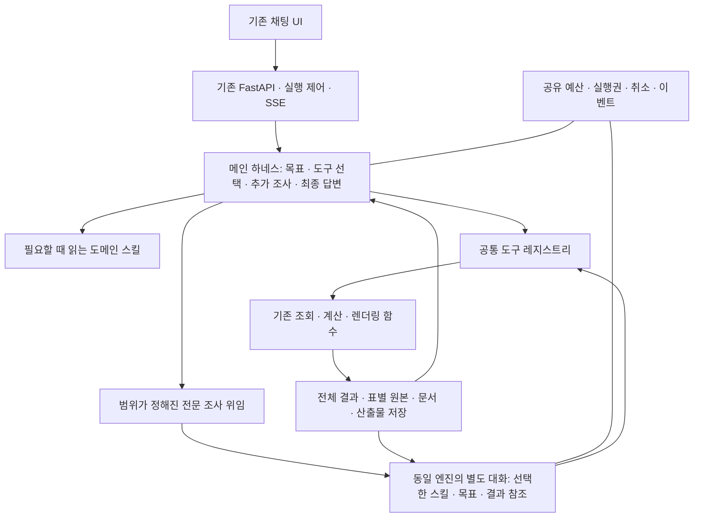

# Hermes 구조를 차용한 기존 Yield Harness 업그레이드 설계

작성일: 2026-09-19. 상태: 사용자 검토용 설계안. 이 문서는 구현 완료 보고서가 아니다.

## 1. 결정과 제안

### 사용자가 확정한 방향

- 기존 `08-YieldAgent/harness/`를 업그레이드한다. Hermes를 설치해 실행 엔진으로 교체하거나 MCP를 통해 Hermes를 호출하지 않는다.
- 복합 요청은 필요한 이력·원본 보고서·웨이퍼 맵까지 예산 안에서 자동 조사한다. 조사 중 진행 상황을 보여준다.
- 현재 UI, FastAPI 진입점, Oracle/OpenSearch 조회 자산, Mongo 결과 저장, Python 격리 환경을 활용한다.
- 자연어 키워드·정규식·실패 문구별 분기·few-shot 누적으로 계획 오류를 보정하지 않는다.
- 현재 단계에서는 전체 계획을 작성한다. 애플리케이션 코드, 실행 설정, 서버는 변경하지 않는다.

### 답변을 요청한 운영 선택

| 선택 | 현재 설계의 제안값 | 미응답 시 취급 |
|---|---|---|
| 자동 조사 시간 | 최종 답변을 포함해 활성 실행 최대 5분 | 2026-09-19 사용자가 5분으로 승인함 |
| 마이닝 API | 서비스가 없으면 `unavailable`로 표시하고 나머지를 출시 | API 존재 여부 확인 전에는 마이닝 완료·전체 9개 영역 운영 완료를 선언하지 않음 |

이 두 선택은 예산 설정과 마이닝 출시 범위에 영향을 준다. 결과 계약·기능 연결·도구 실행·대화 복원 설계는 동일하다.

### 구현자가 선택할 기본 방침

- LangGraph를 유지한다. Hermes와 동일한 라이브러리·저장소로 바꾸는 일은 목표가 아니다.
- 모델은 현재 선택인 OpenRouter `z-ai/glm-5.3-flash`를 유지한다. 모델 자동 대체와 총 토큰 한도 상향은 포함하지 않는다.
- 실행 중 계획 승인 화면을 매번 요구하지 않는다. 도구로 확인할 수 없는 중요한 정보만 질문한다.
- 외부 DB에 쓰는 권한, 임의 쉘 실행, 인터넷 자율 탐색 권한을 새로 만들지 않는다.
- 기존 사용자 선호·지식 저장을 복원하되, 스킬을 에이전트가 자동으로 수정·배포하는 기능은 이번 범위에서 제외한다.

## 2. 접근법 비교

| 접근 | 장점 | 비용·한계 | 선택 |
|---|---|---|---|
| 현재 도구만 더 등록 | 작은 수정으로 일부 기능 회복 | 조기 종료·표 손실·검증·맥락 문제는 남음 | 불충분 |
| 기존 하네스의 계약과 전문 조사 구조를 단계적으로 개선 | 기존 운영 자산 보존, 문제별 검증·롤백 가능 | 기능 목록과 데이터 의미를 면밀히 대조해야 함 | 채택 |
| Hermes 코드베이스를 기반으로 재구축 | Hermes 런타임을 직접 활용 | API/UI/세션/저장/도메인 기능을 다시 이식해야 함 | 현재 요구와 다름 |

## 3. 목표 구조

메인 하네스가 전체 목표와 최종 답변을 관리한다. 단순 조회·계산·파일 생성은 함수를 직접 호출한다. 독립적인 다단계 조사만 같은 엔진의 하위 실행으로 넘긴다. 하위 실행에는 목표, 허용 도구, 스킬, 필요한 결과 참조만 전달하며 전체 부모 대화는 복제하지 않는다.

기존 9개 노드를 다시 supervisor 아래에 붙이는 방식은 사용하지 않는다. 기존 에이전트의 SQL·계산·시각화·전문 지침을 재사용하며, 중복 planner/replanner·독립 예산·자동 승인 루프는 새 실행 경로에 중첩하지 않는다. 이것은 기존 전문 기능을 버린다는 뜻이 아니다.

## 4. Hermes에서 채택할 부분과 프로젝트 고유 부분

| 영역 | 차용할 구조 | 이 프로젝트의 적용 |
|---|---|---|
| 실행 루프 | 모델 도구 호출 → 실행 결과 → 다음 판단 | 기존 `graph.py`, `nodes.py`, `executor.py` 개선 |
| 도구 | schema·handler·사용 가능 여부를 registry에서 관리 | 기존 `ToolRegistry` 확장, 하나의 실행·오류·예산 경로 사용 |
| 스킬 | 목록은 짧게, 본문과 참고 자료는 필요할 때 읽기 | 도메인 지침을 공통 프롬프트에서 분리 |
| 위임 | 같은 엔진, 별도 대화, 제한한 도구와 목표 | 기존 `delegation.py` 확장, 전문 역할별 엔진 복제 금지 |
| 맥락 | 긴 기록 압축, 원본 보관, 도구 호출/결과 관계 보존 | 기존 결과 저장·archive·압축 재사용 |
| 가시성 | 실행 이벤트와 사용자용 진행 안내 | 기존 SSE에 정확한 상태와 하위 작업 관계 추가 |

Hermes 공식 문서의 공통 엔진·도구 registry 설명을 참고한다. [Architecture](https://hermes-agent.nousresearch.com/docs/developer-guide/architecture)

스킬을 필요할 때 읽는 방식은 공식 progressive disclosure 설명을 따른다. [Skills System](https://hermes-agent.nousresearch.com/docs/user-guide/features/skills)

압축과 캐시 관련 개념을 참고하되 공급자별 캐시 절감이나 임의 압축 임계값을 보장하지 않는다. [Context Compression and Caching](https://hermes-agent.nousresearch.com/docs/developer-guide/context-compression-and-caching)

참조 소스 기준은 `nousresearch/hermes-agent`의 `a51143fbbe6ddbc0c7f403d0579c4d75504c6793`이다. 직접 코드를 가져오는 경우 MIT 고지를 보존한다. [참조 소스](https://github.com/NousResearch/hermes-agent/tree/a51143fbbe6ddbc0c7f403d0579c4d75504c6793)

부모·자식 합산 예산과 최종 답변 예산 예약은 우리 프로젝트의 요구다. Hermes의 자식 반복 예산 정책과 동일하다고 설명하지 않는다. Hermes의 문자열 기반 종료 보정이나 공급자별 예외 분기를 그대로 복사하지 않는다. 별도 완료 검토가 없는 구조라고도 전제하지 않는다.

## 5. 실행과 종료 계약

1. 사용자 원문·최신 정정·선호·관련 이전 답변을 읽는다. 결과 원본을 전부 프롬프트에 반복 삽입하지 않는다.
2. 모델이 도구 또는 스킬을 선택한다. 조회 가능한 최신 날짜·제품·보고서 목록은 도구로 확인한다.
3. 도구 결과를 성공·부분·빈 자료·오류로 구분하고, 원본과 범위·단위·누락을 저장한다.
4. 모델이 다음 조사, 독립 조사 위임, 필요한 질문, 최종 답변 중 하나를 선택한다.
5. 최종 후보에서만 기존 검토 경로를 수행한다. 매 도구 호출 뒤 별도의 검토 LLM을 추가하지 않는다.
6. 완료 검토는 `finish`, `continue`, `ask_user`를 구분한다. 완료/부분 완료도 함께 기록한다. ‘조회하겠습니다’라는 중간 설명은 의미 검토를 거쳐 계속 조사할 수 있다. 해당 문구를 코드 조건으로 검사하지 않는다.
7. 구조 검사는 소유권·존재·결과 상태·입력 계보를 검사한다. 모든 출처에 동일한 scope 키를 강제하지 않는다. 수율의 주차와 WADS의 날짜 범위처럼 서로 다른 표현의 정합성은 명시된 기간 메타데이터로 확인한다.
8. 검토 피드백은 구체적인 내용 오류·미완료 작업을 짧게 돌려준다. 수치마다 claims/coverage 양식을 채우게 하지 않는다.
9. 예산이 부족하면 새 조사를 시작하지 않고 예약한 자원으로 답변을 마무리한다. 확인된 결론과 미확인 이유를 분리한다. 실제 오류는 시간초과·토큰·429·공급자 장애·자료 없음으로 구분한다.
10. 공급자 장애로 본문 생성도 실패하면 저장된 구조화 수치·조회 범위·원본 링크를 제공한다. 미검토 초안이나 임의 stdout을 검증된 설명으로 승격하지 않는다.

상태 전이는 `running ↔ waiting_user`, `running → completed|partial|failed|cancelled`를 유지한다. `continue`는 별도 최종 상태가 아니라 같은 run의 조사 재개다. 복구·중복 요청·epoch 경계는 유지한다.

## 6. 결과 계약과 원본 접근

- 기존 단일 `rows` 결과는 계속 읽는다. 신규 결과에는 표별 `table_id`, 제목, 열, 행 수, 전체성, 단위, 원본 참조를 저장할 수 있게 한다.
- Python의 여러 `emit_table` 호출을 다른 표로 보존한다. 서로 다른 schema를 하나의 빈칸 많은 표로 합치지 않는다.
- 여러 표인 결과를 읽을 때는 `table_id`를 명시한다. 단일 표와 기존 결과에서는 생략 가능하다.
- `run_python`은 선택한 결과의 전체 저장 행을 읽는다. 원본 자체가 잘린 경우 그 사실은 계산 결과에도 계승한다. 미리보기로 전체 최저값을 계산하지 않는다.
- 저장 미리보기의 생략과 DB 조회 자체의 일부 수집을 다른 필드로 구분한다. ‘표시 20행/전체 884행’과 ‘원본 전체 수 미확인’은 다른 상태다.
- WADS HTML·불량이력 본문은 소유권을 확인해 모델이 페이지 단위 텍스트로 읽을 수 있게 한다. 원본 HTML과 다운로드 파일은 그대로 보관한다.
- 문서 내용은 데이터로 전달하며 내부 명령을 시스템 지시로 취급하지 않는다. 모델이 읽는 경로는 임의 URL·호스트 파일 접근이 아니라 저장된 결과/문서 식별자다.
- 모든 파생 결과와 보고서는 실제 사용한 출처만 기록한다. 다른 제품·기간의 표가 덮어써지지 않게 한다.

## 7. 도메인 기능 보존 행렬

| 기존 영역 | 직접 도구로 제공할 기능 | 전문 조사에서 활용할 지식 | 필수 완료 증거 |
|---|---|---|---|
| 수율 `yield_agent` | 일/주/월 집계, 최신 자료 시점, 웨이퍼별 원본, 산점도, 이상감지 수치 | 단위·지표 방향·표본 수·부분 기간 해석 | 원본 SQL과 집계/웨이퍼 집합 대조 |
| WADS `wads_agent` | 보고서 탐색, 제품/기간/항목/발행 시각 조회, 원문 읽기, GROUPKEY/LOT/WF 연결, 통계 | 보고서 중복 제거·검출과 원인의 구분 | 보고서 수와 웨이퍼 수를 독립 대조, 원문 일치 |
| 맵 `map_agent` | LOT/WF/제품/기간 선택, bin/cum/특정 bin, 평균 pass, 기간 차이·영역 비교 | 맵 분모·좌표·측정 시점·부분 자료 해석 | 동일 입력의 수치와 렌더 산출물 대조 |
| 불량이력 `fail_history_agent` | BM25/벡터 검색, 위키 참조, 전체 문서 읽기, HTML/다운로드 | 유사 사례와 현재 원인 구분, 출처 최신성 | 검색 모드/문서 ID/전체 본문/다운로드 검증 |
| LOT `lot_history_agent` | 기존 5개 테이블, 분류·요약·위험도·그룹 HTML | 기존 위험도는 규칙에 따른 표시라는 해석 | 테이블별 원본·분류·HTML 보존 |
| 관련 공정 `relation_tree_agent` | 기존 관련 main_oper 목록 | 후보와 인과 증거의 구분 | 기존 조회 결과와 일치 |
| 그룹 `wt_resp_agent` | 기존 양품/불량 LOT 그룹 | 모집단·선정 기준·비교 한계 | 그룹별 LOT 집합 일치 |
| 마이닝 `mining_agent` | 실제 API의 요청·응답 검증, 결과 표·GINI 표시 | 모델 출력과 인과 확정의 구분 | 실제 서비스가 있을 때만 live 통합 통과 |
| PPT `ppt_export` | 선택한 모든 표·분석·원문·맵의 순서 있는 내보내기 | 확인된 결과·가설·미분석 상태의 문서화 | 내용 추출·수치/출처 대조·슬라이드 육안 검토 |
| 사용자 기억 | 기존 프로필 읽기·피드백 반영 | 선호는 참고, 현재 요청이 우선 | 세션 간 선호, 사용자 격리, 오류 시 본 작업 지속 |

### 데이터 의미를 보존하는 조건

- 기존 PT1H A-bin Pass 정의는 재사용 가능하다. 파라미터별 값과 전체 pass rate를 같은 지표처럼 취급하지 않는다. 요청이 불명확하면 해당 정의를 설명하거나 필요한 선택만 질문한다.
- 주차·날짜는 기존 업무 기간 변환을 재사용하고, 요청 범위와 실제 관측 범위를 함께 보관한다. 현재 날짜를 2026-09-12 또는 특정 데이터 끝 날짜로 고정하지 않는다.
- 재검사 중복·측정 시점·분모·빈 웨이퍼 처리 기준을 도구 설명과 결과 메타데이터에 드러낸다. 기준이 확인되지 않은 항목은 ‘미확정’이며 전체 최저 순위나 열화 판정을 확정하지 않는다.
- `_fetch_wafer_scatter`의 파라미터 행 제한과 기간 맵의 5,000/10,000행 제한은 완전한 모집단이라는 증거가 아니다. 순위는 전체 조회 또는 DB 집계/순위에서 계산한다. 상한 도달 시 부분 결과로 표시한다.
- 전체 최저 웨이퍼는 동률도 보존한다. 값이 없는 주차를 0%로 바꾸지 않는다.
- 기존 이상감지 계산과 설명의 기준을 일치시키고, 지표 방향의 도메인 타당성이 확인된 것만 열화/개선으로 표현한다.
- WADS 통계는 보고서 고유 식별자별 건수와 연결된 웨이퍼 수를 분리한다. 조인 누락 비율을 보존한다.
- 최근 자료 시점을 묻는 요청과 최근 기간 수율 요청은 구분한다. 데이터가 오래됐다고 요청 기간을 임의로 이동시키지 않는다.

## 8. 스킬과 하위 에이전트

초기 스킬은 `yield-analysis`, `wads-investigation`, `wafer-map-analysis`, `failure-investigation`, `report-writing`으로 나눈다. LOT/관련 공정/그룹/마이닝은 조사 스킬에서 필요한 직접 도구로 사용한다. 에이전트 9개를 기계적으로 LLM 9개로 만들지 않는다.

스킬에는 목적, 데이터 의미, 사용 가능한 도구, 조사 판단 기준, 결과의 한계를 기록한다. 특정 한국어 입력을 맞추는 예시 목록은 넣지 않는다. 모델은 짧은 목록을 보고 필요한 본문·참고 자료를 읽는다. 로딩한 버전과 hash를 run에 남긴다.

하위 조사 입력은 `question`, `skill_names`, `result_ids`, `allowed_tools`다. 부모가 이미 확인한 목표·제약을 좁게 전달한다. 자식은 같은 엔진에서 도구 조회·원문 읽기·격리 Python 계산을 할 수 있다. 결과는 짧은 설명, 결과 참조, 한계, 상태, 필요한 질문으로 반환한다. 전체 도구 이력을 부모 프롬프트에 붙이지 않는다.

기존 깊이 1, 자식 최대 2개, 도메인 동시 실행 2개부터 시작한다. 부모/자식 토큰·모델/도구 호출·활성 시간을 합산하고 부모의 마무리 예산을 보호한다. 자식이 기다리는 질문은 부모가 다른 결과와 함께 검토해 필요할 때 한 번 묻는다. 단순 조회에는 위임을 강제하지 않는다.

## 9. 입력 토큰과 실행 예산

| 문제 | 처리 |
|---|---|
| 전체 도구 schema·도메인 지침 반복 | 짧은 목록 + 선택한 도구와 스킬만 로딩 |
| 원본 표·긴 보고서·stdout 누적 | 저장소 원본 + 짧은 descriptor + 필요한 표/문서 페이지 |
| 과거 대화·도구 결과·선택 근거 중복 | 단일 맥락 조립, result 참조, 관련 근거 선택, 도구 호출/응답 묶음 보존 |
| 긴 조사·하위 실행·검토가 예산 소진 | 필요한 경우만 위임, 독립 맥락, 합산 제한, 답변/검토 자원 예약 |

`model_usage`에 공통 지침·스킬·도구 schema·대화·메모리·선택 근거·기타 입력의 추정량을 추가한다. 공급자가 반환한 실제 입력/출력/추론/캐시 사용량은 별도로 저장한다. 항목별 추정치를 정확한 청구량으로 제시하지 않는다. 추론 토큰이 출력 사용량에 포함되면 중복 합산하지 않는다.

토큰 120,000, 모델 40회, 도구 24회 등 기존 전체 제한은 자동 상향하지 않는다. 시간은 최종 답변·검토를 포함하며 질문을 기다린 시간은 활성 실행 시간에서 제외한다. 공급자 재시도도 공유 예산에 포함한다. 종료 직전까지 자료만 모으는 대신 마무리에 필요한 호출·입력·출력·시간을 먼저 남긴다.

빠른 결과를 보장하려고 모든 부분 답변을 성공으로 판정하지 않는다. 근거가 없는 원인 단정도 하지 않는다. 실제 모델의 추론 품질과 지연은 구조 개선 후 동일 모델·동일 데이터로 비교한다.

## 10. UI·대화·복구

- 기존 화면 배치를 유지한다. 도구별 실행 중/완료/부분/오류/취소, 실제 소요 시간, 부모/자식 관계만 명확히 추가한다.
- ‘자료를 찾는 중’, ‘비교 결과를 확인하는 중’ 같은 사용자용 진행 안내와 도구 이벤트를 구분한다. 내부 사고 과정은 노출하지 않는다. 진행 설명을 위해 별도 LLM 호출을 추가하지 않는다.
- 보충 질문과 사용자의 답, 조건 변경을 이력에 복원한다.
- 질문 대기 상태에서도 중지 버튼을 제공한다. 취소는 취소 API로 처리한다.
- 100회 이상 대화도 최신 실행을 찾고 페이지별 이력을 읽는다.
- 복원 snapshot과 이벤트 sequence 기준을 맞춰 완료 순간 새로고침에도 답변/산출물이 한 번씩 표시되게 한다. 산출물 순서를 보존한다.
- 실행 중/질문 대기/복구 중의 runtime 버전을 고정한다. 구버전 checkpoint를 신버전 graph에 임의로 넣지 않는다.
- 기존 MCP 인터페이스는 유지한다. 고정 세션의 비정상 종료 복구를 보완하지만 MCP가 이번 구조의 필수 경로가 되지는 않는다.
- 예외에는 안전한 오류 코드·원인·재시도 가능성을 남긴다. 자격증명과 연결 문자열을 노출하지 않는다.

## 11. 검증과 완료 조건

기존 2026-09-12 감사의 122개 단위 검사 통과는 baseline 참고 자료다. 이번 설계 단계에서 새 검증을 실행했다는 뜻이 아니다. [기존 감사](../../../outputs/harness-comprehensive-audit-2026-09-12.md)

출시 검증은 다음 네 층을 모두 수행한다.

1. 재현 가능한 가상 모델/DB 검사: 상태 전이, 중복 이벤트, 예산, 오류, 원본 보존.
2. 실제 도메인 함수+DB: SQL 집계·웨이퍼 집합·원문·맵·PPT 수치 독립 대조.
3. 실제 현재 모델+실제 도구: 아래 사용자 시나리오를 끝까지 수행.
4. 브라우저: 진행 안내·질문·중지·새로고침·다운로드·이력까지 확인.

필수 실제 시나리오:

- 최근 자료가 며칠까지 있는지 확인 → 요청 제품으로 후속 조회.
- 최근 4주 4SS 수율과 열화 원인 → 추가 이력/원문/맵이 필요한 경우 조사 → 사실과 가설을 구분한 답변.
- 주차별 PT1H 최저 웨이퍼 → metric 명확화가 필요한 경우 질문 → 동률/누락 포함 목록 → 해당 웨이퍼 맵.
- 2026년 8월 WADS 통계 → 해당 원본 보고서 → 검출 웨이퍼 연결.
- 두 기간/제품 비교 → 통계·맵·분석을 포함한 PPT → 선택 출처가 모두 실제 문서에 반영됨.
- LOT 이력, 불량이력 전체 본문, 관련 공정/양불 그룹, 실제 마이닝은 해당 서비스 준비 상태별 검증.
- 30턴 맥락/정정/원문 재조회, 질문 두 번과 재개, 실행 중 조건 변경, 질문 대기 취소, 새로고침, 101번째 실행 재연결.

정상 시나리오에서 시간/토큰 예산 종료·실패한 필수 도구·행만 나열한 미완료는 통과가 아니다. 서비스 장애를 의도적으로 주입한 검사는 정확한 제한 설명·부분 결과·취소/복구 동작으로 평가한다. 도구 이름 존재만으로 합격시키지 않는다.

고정 DB fixture 수치 검사는 오차 규칙과 동률을 명시한다. live 결과는 실행 시 독립 조회한 정답과 대조하고 날짜·건수를 프롬프트에 하드코딩하지 않는다. 핵심 4개 실제 대화는 같은 구성으로 각각 3회 수행해 성공 수/시도 수를 공개한다. 소규모 반복 결과를 전체 신뢰도 보증으로 표현하지 않는다.

검증 기록에 코드 지문(미커밋 변경 포함), 모델/생성 설정, 스킬/도구 버전, 데이터 출처, run ID, 수치 대조, 산출물 hash, 시간·토큰을 연결한다. 다른 실행의 README 같은 파일로 출시 증거를 대신하지 않는다.

## 12. 단계적 적용과 범위 밖

변경은 결과 계약 → 도메인 기능 → 스킬/루프/위임 → 대화/화면 → 실제 검증 순서로 나눈다. 각 단계는 기존 검사와 해당 회귀를 통과한 뒤 다음으로 진행한다. 새 runtime은 새 세션에서 먼저 시험하며, 기존 세션/산출물 읽기를 유지한다. 기본 전환 전에는 live 검증을 완료한다.

이번 범위 밖: Hermes 전체 설치/포크, 새 채팅 UI, 외부 다중 사용자 인증 구축, 범용 데스크톱/브라우저 조작 에이전트, 무제한 백그라운드 조사, 자동 스킬 자기 수정, 새로운 마이닝 알고리즘 개발, 별도 `/repl` 제품 통합. 현재 동작이 없는 마이닝 서비스를 만들었다고 간주하지 않는다.

출시 명칭도 범위에 맞춘다. 마이닝 미연결이 남으면 ‘하네스 핵심/연결된 도메인 개선 완료’이고 ‘모든 기능 완료’가 아니다.
