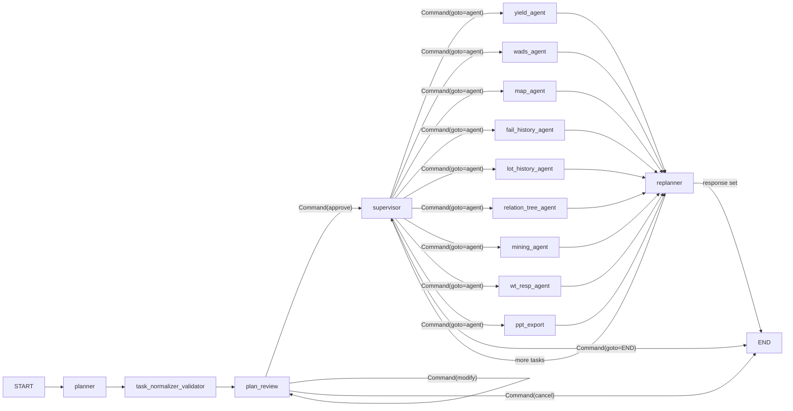

# Orchestration Graph

The supervisor graph is a LangGraph `StateGraph` built in `08-YieldAgent/supervisor.py`. It implements a **plan-and-execute** pattern: a planner produces canonical requests, a task normalizer/validator normalizes them, a plan-review gate optionally asks the user to approve multi-task plans, the supervisor dispatches tasks to domain agents, and a replanner fills chained inputs and decides whether to continue or end.

## Graph topology



The graph is assembled in `supervisor.py` (lines ~133–179). Routing from `supervisor` to agents is done via `Command(goto=...)` returns from `supervisor_node`, not `conditional_edges`. All agent nodes edge to `replanner`. The replanner's `should_end` function checks `state["response"]`: if set, the turn ends (`END`); otherwise it returns to `supervisor` for the next pending task.

## Nodes and responsibilities

### planner (`node_planner.py`)

The planner is the entry node. It calls an LLM with `CANONICAL_PLANNER_SYSTEM_PROMPT` to convert the user message plus recent context into a `CanonicalPlanResponse` — a list of `CanonicalRequestItem` objects (each with `intent`, `agent`, `slots`, `goal`). It then calls `build_tasks_from_canonical_requests` to produce the `task_plan` and `pending_tasks`. Key invariants:

- The planner sees a tight **referent window** of 3 recent raw turns (`_PLANNER_REFERENT_TURNS`) to resolve follow-up references like "그거" / "아까 그". Cross-turn data depth is carried by `recent_results`, not raw turns.
- The planner emits `time_range` as natural labels (e.g. `"2026-W17"`) rather than doing YYYYMMDD arithmetic — the supervisor converts these to `ref_date`/`periods`/`unit` before dispatch via `resolve_time_range`.
- If the planner produces no executable task, `_llm_empty_plan_response` generates a natural-language answer instead of a hard refusal.

### task_normalizer_validator (`node_normalizer.py`, `task_normalizer_validator.py`)

A narrow deterministic layer that normalizes field-name aliases (`map_lot_ids` → `lot_ids`, `dh_fail_type` → `fail_type`) and resolves **ordinal reference tokens** (`#1`, `#last`, `#R2`) against `recent_results` rows. The deterministic gates that once lived here (allow-list dropping, value blanking, missing-param, cost/fanout) were removed; the planner now resolves references and the supervisor dispatch guard validates required params.

### plan_review (`node_plan_review.py`)

When the task plan has **2 or more tasks**, `plan_review_node` interrupts the user to approve, modify, or cancel. Single-task plans pass through immediately. This node enforces a strict **one interrupt + one LLM call per super-step** discipline: a `modify` action commits the updated plan and returns `Command(goto="plan_review")` to re-enter a new super-step, avoiding LangGraph replay bugs. See [HITL Contracts](hitl-contracts.md) for the resume protocol.

### supervisor (`node_supervisor.py`)

The supervisor pops the next task from `pending_tasks`, validates required slots (raising a `missing_param` interrupt if any are empty), converts `time_range` labels to `ref_date`/`periods`/`unit`, resolves chained params from prior results (via `wads_context._resolve_chained_params`), and dispatches via `Command(goto=<agent>, update={current_task, ...})`. When no tasks remain, it sets `response` and returns `Command(goto=END)`.

### replanner (`node_replanner.py`)

After each agent completes, the replanner records the outcome (`past_steps`), updates `recent_results`, and checks whether pending tasks have empty chained inputs that need filling (`_needs_replan`). If so, it calls the LLM (`REPLANNER_SYSTEM_PROMPT`) to fill them. It then sets `response` if all tasks are done (→ `END` via `should_end`) or returns to `supervisor`.

### Rewrite node

The original architecture had a `rewrite` node (user message rewriting for ambiguous queries). The current graph starts directly at `planner`; the rewrite concept is folded into the planner's canonicalization.

## Recent results context

`recent_results.py` maintains a bounded index (max 10 entries, max 50 rows each) of recent agent results in `state["recent_results"]`. The planner and replanner consume this via `_recent_results_prompt_context` to resolve references like "N번째 리포트" or "그 lot들". Each entry is payload-free (artifact bodies stay in `*_artifacts` state keys) and built by `build_recent_result_index_entry` in `result_contracts.py`.

## Retry policy

All agent nodes and the planner/supervisor/replanner use a `RetryPolicy(max_attempts=3, initial_interval=1.0, retry_on=is_transient_error)` from `common.py`. LangGraph's default rejects `OSError`/`TimeoutError`; `is_transient_error` classifies Oracle/LLM transient errors consistently.

## When to consult this page

- Adding a new agent node to the graph.
- Changing the planner's canonical request schema or slot rules.
- Modifying the replanner's chained-input filling logic.
- Changing the plan-review approval flow.

## Change recipe: adding a new agent node

1. Define the node function `<name>_agent_node(state, config)` returning `{messages, *_artifacts, ...}` and attaching a result envelope via `attach_result_envelope`.
2. Add an `AGENT_SLOT_RULES` entry in `canonical_request.py` with `allowed`/`required` slots.
3. Add the agent name to `_AGENT_NAMES` in `orch_utils.py`.
4. Wire the node in `supervisor.py`: `workflow.add_node("<name>", <name>_agent_node, retry_policy=_retry)` and `workflow.add_edge("<name>", "replanner")`.
5. Ensure the planner and replanner prompts know the new agent name (add it to the `agent` enum in `CanonicalRequestItem`).
6. Add an E2E regression case in `tests/test_e2e_regression.py`.

## Validation

```bash
# Requires the server running on :8001
uvicorn 08-YieldAgent.agent_server:app --port 8001 &
pytest tests/test_e2e_regression.py -v
```

The headline regression case `yield_4ss_3w_regression` pins the behavior that "4SS" must land in the `lotcd` slot (not `unit`) and the turn must run `yield_agent` without a missing-제품코드 HITL block.
