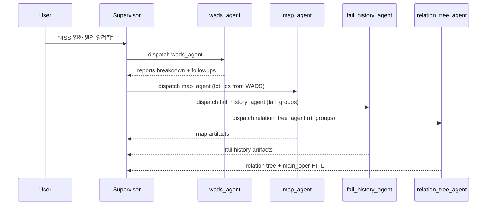

# Domain Agents

Each domain agent is a LangGraph node function (`*_agent_node`) that reads `state["current_task"]["params"]`, executes its domain logic, produces HTML/PPTX artifacts, and returns updated state. All agents attach a [result envelope](../architecture/state-and-contracts.md#result-envelope-contract) to their `AIMessage`.

## Agent overview

| Agent | Responsibility | Data source | Output artifacts |
|---|---|---|---|
| `yield_agent` | Weekly/monthly/daily yield query + anomaly detection + LLM analysis | Oracle `DF_DIE_TO_WF_YLD`, `DF_GMS_YIELD_*` | HTML tables, scatter plots, `weeks_data` |
| `wads_agent` | WADS degradation report query (ReAct subgraph) | Oracle `DF_WADS_REPORT`, `DF_WADS_WF_LIST` | WADS HTML reports, report breakdown envelope |
| `map_agent` | Wafer binmap/cummap visualization | Oracle `LANGGRAPH_DATA` | HTML with base64 PNG wafer maps |
| `fail_history_agent` | Fail/degradation history search (OpenSearch hybrid) | OpenSearch `fail-history` index, wiki vault | HTML report with cited source docs |
| `lot_history_agent` | Comprehensive LOT history (5 Oracle tables) | Oracle `DF_FDC_ALARM`, `DF_QTIME_OVER`, `DF_TROUBLE_LOT`, `DF_FUTURE_ACTION`, `DF_SAMPLE_SPLIT` | Rich HTML report (CSS/JS, sticky nav) |
| `relation_tree_agent` | Related main_oper lookup + main_oper selection HITL | Oracle `DF_WADS_MAIN_OPER` | HTML relation tree, main_opers envelope |
| `mining_agent` | Gini-based parameter mining (good vs bad lots) | Mining API (currently dummy) | Dynamic HTML gini table |
| `wt_resp_agent` | WT response analysis (good/bad lot lookup) | Oracle `DF_WADS_GOOD_BAD_LOT` | HTML report, group_good/group_bad state |
| `ppt_export` | Convert all artifacts to PPTX | State artifacts | PPTX file (`file://` ref) |

## yield_agent

`yield_query_agent.py` — Queries yield data for a product (`lotcd`) across a time range. Fetches weekly/monthly/daily data from Oracle via `yield_db._fetch_periods`, builds HTML tables and scatter plots via `yield_viz`, detects anomalies (delta/change_pct between periods), and streams an LLM analysis. Supports LOT-vs-LOT comparison tables.

**Slot schema**: `{lotcd, ref_date, unit, periods, time_range}`, required: `lotcd`.

**Key symbols**: `yield_agent_node`, `_analyze_with_llm`. Imports `_fetch_periods`, `_fetch_wafer_scatter`, `_fetch_lot_sql` from `yield_db`; `_build_table`, `_build_html_table`, `_build_scatter_html`, `_detect_anomalies` from `yield_viz`.

## wads_agent

`wads_agent.py` — A ReAct agent (subgraph using `create_react_agent`) that queries WADS (Wafer Analysis Detection System) degradation reports from Oracle. The LLM decides which tools to call. Produces per-report breakdowns and emits fan-out followups to `map_agent`, `fail_history_agent`, and `relation_tree_agent` via the envelope `extensions.wads_agent.reports`.

**Tools** (from `wads_tools.py`):
- `wads_query_data` — filter WADS metadata
- `wads_get_html_report` — fetch HTML report content
- `wads_query_sql` — LLM-generated SQL for complex queries

**Slot schema**: `{lotcd, wads_start_tm, wads_end_tm, fail_type, wads_category}`, required: none.

**Fan-out**: WADS results can chain to downstream agents. `wads_context.py` provides `_latest_wads_result`, `_wads_groupkeys_by_map_oper`, and `_resolve_chained_params` to bridge WADS output to map/fail_history/relation_tree fan-out. The `fail_groups` and `rt_groups` slots accept `[{lotcd, parameter, lot_ids}, …]` for per-report batch processing.

## map_agent

`map_agent.py` — Queries wafer map data from Oracle (`LANGGRAPH_DATA` table, `map_val_json` CLOB column) and renders binmap/cummap PNG visualizations as base64-embedded HTML. Supports `lot_ids`, `groupkey` (lot.wf), `wf_mod`/`wf_rem` wafer-pattern filters, and `map_oper` filter.

**Slot schema**: `{lot_ids, wf_ids, groupkey, map_type, map_oper, wf_mod, wf_rem, map_label, map_groups}`, required: `map_oper` + (lot_ids ∨ groupkey).

## fail_history_agent

`fail_history_agent.py` — Searches fail/degradation history documents via OpenSearch hybrid search (BM25 + kNN vector). Uses a **wiki-first gate**: `wiki_store.lookup_concept_body` checks if a synthesized concept exists for the (product, fail_type, cause_oper) triple. If it does, the concept body is returned directly (0 LLM calls). Otherwise, raw results are returned with LLM 1-pass synthesis and cited documents. Supports WADS fan-out via `fail_groups`.

**Data sources**: OpenSearch `fail-history` index (env `OPENSEARCH_INDEX`), embedding API (OpenRouter `qwen3-embedding-8b`, 4096-dim), wiki vault notes.

**Slot schema**: `{lotcd, fail_type, cause_oper, dh_query, fail_groups}`, required: none.

See [Wiki System](../wiki/wiki-system.md) for the wiki-first/wiki-assisted gate and [Data Layer](data-layer.md) for OpenSearch details.

## lot_history_agent

`lot_history_agent.py` — Queries comprehensive LOT history from 5 Oracle tables and renders a rich HTML report with CSS/JS (sticky nav, risk dots, collapsible sections). Deterministic node (no LLM).

**Slot schema**: `{lot_ids}`, required: `lot_ids`.

## relation_tree_agent

`relation_tree_agent.py` — Finds related `main_oper` candidates for a (lotcd, fail_type) pair from Oracle (`DF_WADS_MAIN_OPER`), renders a placeholder relation tree HTML, and emits a main_oper selection HITL followup that routes to `wt_resp_agent`. Supports WADS fan-out via `rt_groups`.

**Slot schema**: `{lotcd, fail_type, cause_oper, rt_groups}`, required: `lotcd, fail_type`.

## mining_agent

`mining_agent.py` — A ReAct agent that performs Gini-based parameter mining comparing good vs bad LOT groups. Calls a mining API (currently `mining_dummy_api` returning DataFrames mimicking the real schema: GINI, Score, Commonality, Purity, JSD). Renders a dynamic HTML gini table. Memoizes by input signature.

**Slot schema**: `{lotcd, fail_type, cause_oper, wads_category, group_good, group_bad, tech, user_id, rank_limit}`, required: none.

## wt_resp_agent

`wt_resp_agent.py` — WT (wafer test) response analysis: looks up good/bad LOT groups from Oracle (`DF_WADS_GOOD_BAD_LOT`) for a (lotcd, fail_type, cause_oper=main_oper) and emits a `mining_agent` followup. Deterministic node.

**Slot schema**: `{lotcd, fail_type, cause_oper}`, required: all three.

## ppt_export

`ppt_export_agent.py` — Converts all accumulated state artifacts into a PPTX file. Resolves `file://` artifact refs to inline content, then calls `YieldReportPPTBuilder.build_compact(state)`.

### PPT pipeline

- `ppt_llm_designer.py` — Uses GLM-4.7 (OpenRouter) to generate a `PresentationDesign` JSON (color scheme, slide designs, element designs). Supports `generate_extra_slide()` for WADS/fail_history/lot_history/relation_tree/analysis sections.
- `ppt_renderer.py` — `render_presentation(prs, design, state)` applies the LLM design to python-pptx slides (backgrounds, textboxes, tables, charts).
- `ppt_builder.py` — `YieldReportPPTBuilder` uses `template.pptx`, runs the `build_compact(state)` pipeline: state → GLM-4.7 design → renderer → PPTX bytes + file path. Output: `generated/yield_report_{lotcd}_{ref_date}_{uuid}.pptx`.

## Wafer zones

`wafer_zones.py` — Static 9-zone wafer die coordinate map (`WAFER_ZONES` dict: TL/TM/TR/ML/MM/MR/BL/BM/BR with explicit die (x,y) lists). `compute_zone_deltas` computes zone average deltas; `worst_zone` finds the most degraded zone. Used by `yield_viz` for spatial anomaly analysis.

## Chained fan-out pattern

WADS results trigger downstream analysis. The flow is:



## When to consult this page

- Adding or modifying a domain agent's behavior or artifacts.
- Changing an agent's slot schema.
- Modifying the WADS fan-out or chained-input pattern.

## Validation

```bash
# E2E regression (requires server on :8001)
pytest tests/test_e2e_regression.py -v

# Verification scripts
pytest tests/verify_mining_artifact.py tests/verify_failtype_inherit.py tests/verify_relation_chain.py tests/verify_postwads_failtype.py -q
```
